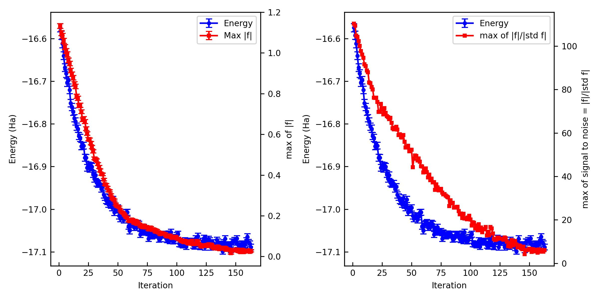
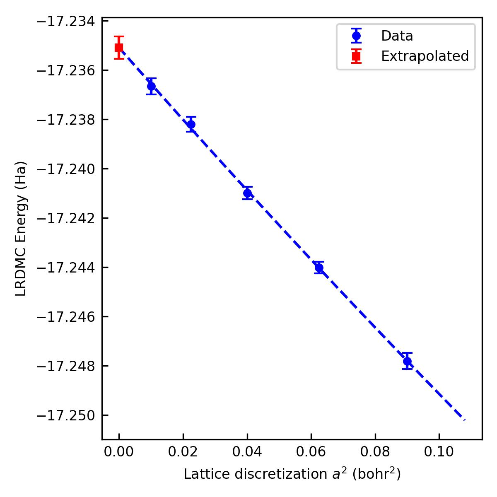
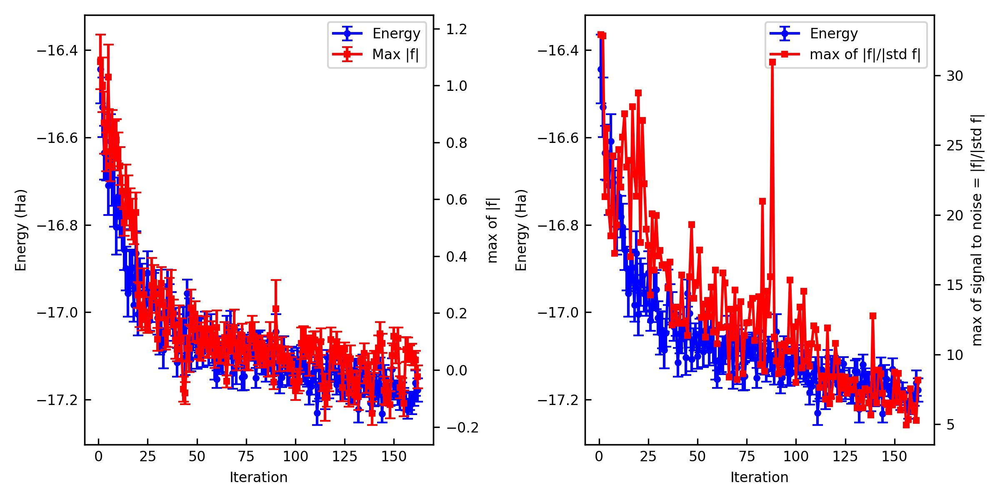
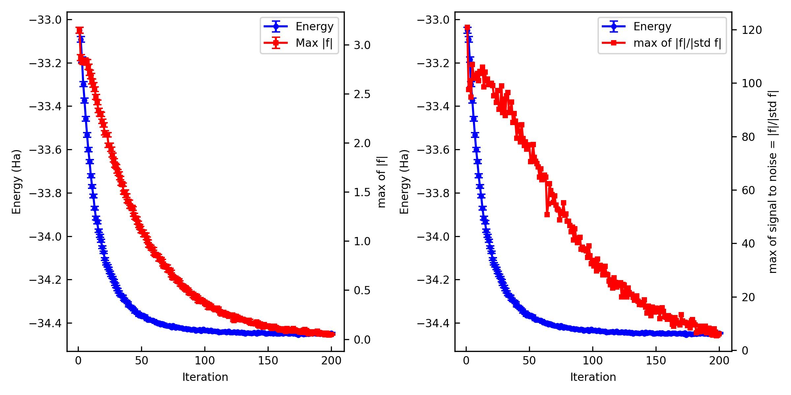
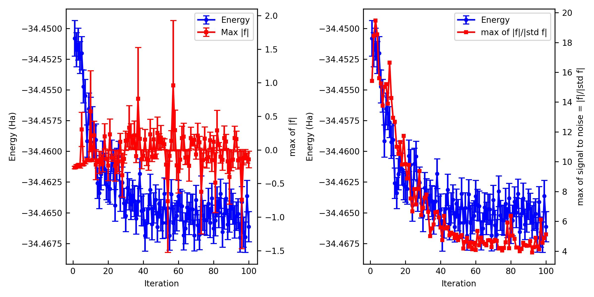
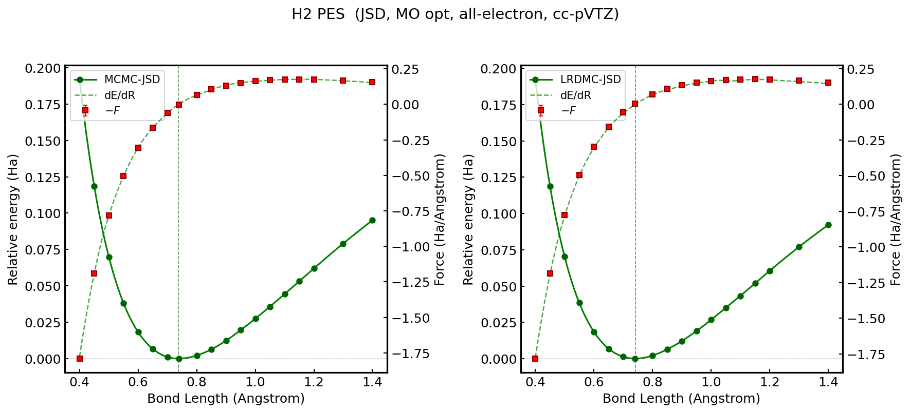
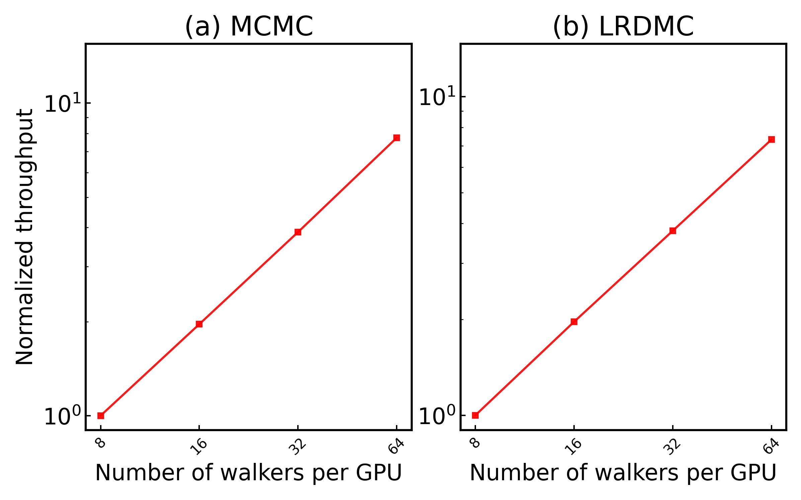

(examples_link)=

# Examples

Example files for **jQMC** are found at
<https://github.com/kousuke-nakano/jQMC/tree/main/examples>.

## jqmc-example01:

Total energy of water molecule. One can learn how to obtain the VMC and DMC (in the extrapolated limit) energies of the Water dimer, starting from scratch (i.e., DFT calculation), with cartesian GTOs.

### Setup

Create a working directory and move into it.

```bash
% mkdir water_qmc && cd water_qmc
```

### Generate a trial WF

The first step of ab-initio QMC is to generate a trial WF by a mean-field theory such as DFT/HF. `jQMC` interfaces with other DFT/HF software packages via `TREX-IO`.

One of the easiest ways to produce it is using `pySCF` as a converter to the `TREX-IO` format is implemented. Another way is using `CP2K`, where a converter to the `TREX-IO` format is implemented.

The following is a script to run a HF calculation for the water molecule using `pyscf-forge` and dump it as a `TREX-IO` file.

> [!NOTE]
> This `TREX-IO` converter is being develped in the `pySCF-forge` [repository](https://github.com/pyscf/pyscf-forge) and not yet merged to the main repository of `pySCF`. Please use `pySCF-forge`.

<!-- include: 01DFT/01pyscf-forge/run_pyscf.py -->
```python
from pyscf import gto, scf
from pyscf.tools import trexio

filename = "water_ccecp_ccpvtz.h5"

mol = gto.Mole()
mol.verbose = 5
mol.atom = """
               O    5.00000000   7.14707700   7.65097100
               H    4.06806600   6.94297500   7.56376100
               H    5.38023700   6.89696300   6.80798400
               """
mol.basis = "ccecp-ccpvtz"
mol.unit = "A"
mol.ecp = "ccecp"
mol.charge = 0
mol.spin = 0
mol.symmetry = False
mol.cart = True
mol.output = "water.out"
mol.build()

mf = scf.HF(mol)
mf.max_cycle = 200
mf_scf = mf.kernel()

trexio.to_trexio(mf, filename)
```

Launch it on a terminal. You may get `E = -16.9450309201805 Ha` [Hartree-Forck].

```bash
% mkdir -p 01DFT/01pyscf-forge && cd 01DFT/01pyscf-forge
% python run_pyscf.py

% cd ../..
```

The following is a script to run a LDA calculation for the water molecule using `cp2k` and dump it as a `TREXIO` file.

<!-- include: 01DFT/02cp2k/water.xyz -->
```bash
3

O    5.00000000   7.14707700   7.65097100
H    4.06806600   6.94297500   7.56376100
H    5.38023700   6.89696300   6.80798400
```

<!-- include: 01DFT/02cp2k/water_ccecp_ccpvtz.inp -->
```bash
&global
  project      water_ccecp_ccpvtz
  print_level  medium
  run_type     energy
&end

&force_eval
  method quickstep

  &subsys
    &cell
      abc  15.0 15.0 15.0
      periodic none
    &end

    &topology
      coord_file_format  xyz
      coord_file_name    water.xyz
    &end

    &kind H
      basis_set  ccecp-cc-pVTZ
      potential  ecp ccECP
    &end

    &kind O
      basis_set  ccecp-cc-pVTZ
      potential  ecp ccECP
    &end
&end

  &dft
    multiplicity  1
    uks           false
    charge        0

    basis_set_file_name  ./basis.cp2k
    potential_file_name  ./ecp.cp2k

    &qs
      method gpw
      eps_default  1.0e-15
    &end

    &xc
      &xc_functional
        &lda_x
        &end
        &lda_c_pz
        &end
      &end
    &end

    &poisson
      psolver   wavelet
      periodic  none
    &end

    &mgrid
    cutoff 1000
    rel_cutoff 50
    &end

    &scf
     scf_guess  atomic
     eps_scf    1.0e-7
     max_scf    5
     eps_diis   0.1
     &ot on
        minimizer cg
        linesearch adapt
        preconditioner full_single_inverse
        max_scf_diis 50
     &end ot
     &outer_scf
        eps_scf    1.0e-7
        max_scf    3
     &end outer_scf
      &print
        &restart on
        &end
        &restart_history off
        &end
      &end
    &end

    &print
      &trexio
      &end
      &mo
        energies      true
        occnums       false
        cartesian     false
        coefficients  true
        &each
          qs_scf  0
        &end
      &end mo
      &overlap_condition on
        diagonalization   .true.
      &end overlap_condition
    &end print
  &end dft
&end
```

<!-- include: 01DFT/02cp2k/basis.cp2k -->
```bash
## ccecp-cc-pVTZ
## SOURCE: https://pseudopotentiallibrary.org/recipes/H/ccECP/H.cc-pVTZ.nwchem
## SOURCE: https://pseudopotentiallibrary.org/recipes/O/ccECP/O.cc-pVTZ.nwchem
#####
H ccecp-cc-pVTZ
6
1  0  0  8  1
  23.843185  0.00411490
  10.212443  0.01046440
  4.374164  0.02801110
  1.873529  0.07588620
  0.802465  0.18210620
  0.343709  0.34852140
  0.147217  0.37823130
  0.063055  0.11642410
1  0  0  1  1
  0.091791  1.00000000
1  0  0  1  1
  0.287637  1.00000000
1  1  1  1  1
  0.393954  1.00000000
1  1  1  1  1
  1.462694  1.00000000
1  2  2  1  1
  1.065841  1.0000000
#####
O ccecp-cc-pVTZ
9
2  0  0  9  1
  54.775216 -0.0012444
  25.616801 0.0107330
  11.980245 0.0018889
  6.992317 -0.1742537
  2.620277 0.0017622
  1.225429 0.3161846
  0.577797 0.4512023
  0.268022 0.3121534
  0.125346 0.0511167
2  0  0  1  1
  1.686633 1.0000000
2  0  0  1  1
  0.237997 1.0000000
2  1  1  9  1
  22.217266 0.0104866
  10.74755 0.0366435
  5.315785 0.0803674
  2.660761 0.1627010
  1.331816 0.2377791
  0.678626 0.2811422
  0.333673 0.2643189
  0.167017 0.1466014
  0.083598 0.0458145
2  1  1  1  1
  0.600621 1.0000000
2  1  1  1  1
  0.184696 1.0000000
3  2  2  1  1
  2.404278 1.0000000
3  2  2  1  1
  0.669340 1.0000000
4  3  3  1  1
  1.423104 1.0000000
```

<!-- include: 01DFT/02cp2k/ecp.cp2k -->
```bash
## ccecp-cc-pVTZ
## SOURCE: https://pseudopotentiallibrary.org/recipes/H/ccECP/H.ccECP.nwchem
## SOURCE: https://pseudopotentiallibrary.org/recipes/O/ccECP/O.ccECP.nwchem
ccECP
H nelec 0
H ul
1 21.24359508259891 1.00000000000000
3 21.24359508259891 21.24359508259891
2 21.77696655044365 -10.85192405303825
H S
2 1.000000000000000 0.00000000000000
O nelec 2
O ul
1 12.30997 6.000000
3 14.76962 73.85984
2 13.71419 -47.87600
O S
2 13.65512 85.86406
#####
END ccECP
```

Launch it on a terminal. You may get `E = -17.146760756813901 Ha` [LDA].

```bash
% mkdir -p 01DFT/02cp2k && cd 01DFT/02cp2k
% cp2k.ssmp -i water_ccecp_ccpvtz.inp -o water_ccecp_ccpvtz.out
% mv water_ccecp_ccpvtz-TREXIO.h5 water_ccecp_ccpvtz.h5
% cd ../..
```

> [!NOTE]
> One can start from any HF/DFT code that can dump `TREX-IO` file. See the [TREX-IO website](https://github.com/TREX-CoE/trexio) for the detail.

You can see the content of a TREXIO file by `jqmc-tool`

```bash
% jqmc-tool hamiltonian show-info 01DFT/01pyscf-forge/water_ccecp_ccpvtz.h5

Structure_data
  PBC flag = False
  --------------------------------------------------
  element, label, Z, x, y, z in cartesian (Bohr)
  --------------------------------------------------
  O, O, 8.0, 9.44863062, 13.50601812, 14.45823978
  H, H, 1.0, 7.68753060, 13.12032124, 14.29343676
  H, H, 1.0, 10.16717442, 13.03337116, 12.86522522
  --------------------------------------------------
Coulomb_potential_data
  ecp_flag = True
...

```

You can also see all the variables stored in `hamiltonian_data.h5` by `h5dump` (or the interactive viewer `h5tui`) if it is installed on your machine.

```bash
% h5dump 01DFT/01pyscf-forge/water_ccecp_ccpvtz.h5

HDF5 "hamiltonian_data.h5" {
GROUP "/" {
   ATTRIBUTE "_class_name" {
      DATATYPE  H5T_STRING {
         STRSIZE H5T_VARIABLE;
         STRPAD H5T_STR_NULLTERM;
         CSET H5T_CSET_UTF8;
         CTYPE H5T_C_S1;
      }
      DATASPACE  SCALAR
      DATA {
      (0): "Hamiltonian_data"
      }
   }
...

```

### Optimize a trial WF (VMC)
The next step is to optimize variational parameters included in the generated wavefunction. More in details, here, we optimize the two-body Jastrow parameter and the matrix elements of the three-body Jastrow parameter.

Create a directory for the VMC optimization and move into it. Then generate a template file using `jqmc-tool`. Please directly edit `vmc.toml` if you want to change a parameter.

```bash
% mkdir 02vmc_JSD && cd 02vmc_JSD
% cp ../01DFT/01pyscf-forge/water_ccecp_ccpvtz.h5 .  # or cp ../01DFT/02cp2k/water_ccecp_ccpvtz.h5 .
% jqmc-tool trexio convert-to water_ccecp_ccpvtz.h5 -j2 1.0 -j3 mo
> Hamiltonian data is saved in hamiltonian_data.h5.
% jqmc-tool vmc generate-input -g
> Input file is generated: vmc.toml
```

The generated `hamiltonian_data.h5` is a wavefunction file with the `jqmc` format. `-j2` specifies the initial value of the two-body Jastrow parameter and `-j3` specifies the basis set (`ao`:atomic orbital or `mo`:molecular orbital) for the three-body Jastrow part; `ao` has several choices, so please refer to the command-line reference for the available options.

<!-- include: 02vmc_JSD/vmc.toml -->
```toml
[control]
job_type = "vmc" # Specify the job type. "mcmc", "vmc", "lrdmc-bra", or "lrdmc-tau".
mcmc_seed = 34456 # Random seed for MCMC
number_of_walkers = 4 # Number of walkers per MPI process
max_time = 86400 # Maximum time in sec.
restart = false
restart_chk = "restart.h5" # Restart checkpoint file. If restart is True, this file is used.
hamiltonian_h5 = "hamiltonian_data.h5" # Hamiltonian checkpoint file. If restart is False, this file is used.
verbosity = "low" # Verbosity level. "low" or "high"

[vmc]
num_mcmc_steps = 500 # Number of observable measurement steps per MPI and Walker. Every local energy and other observeables are measured num_mcmc_steps times in total. The total number of measurements is num_mcmc_steps * mpi_size * number_of_walkers.
num_mcmc_per_measurement = 40 # Number of MCMC updates per measurement. Every local energy and other observeables are measured every this steps.
num_mcmc_warmup_steps = 0 # Number of observable measurement steps for warmup (i.e., discarged).
num_mcmc_bin_blocks = 5 # Number of blocks for binning per MPI and Walker. i.e., the total number of binned blocks is num_mcmc_bin_blocks * mpi_size * number_of_walkers.
Dt = 2.0 # Step size for the MCMC update (bohr).
epsilon_AS = 0.0 # the epsilon parameter used in the Attacalite-Sandro regulatization method.
num_opt_steps = 300 # Number of optimization steps.
wf_dump_freq = 1 # Frequency of wavefunction (i.e. hamiltonian_data) dump.
optimizer_kwargs = { method = "sr", delta = 0.15, epsilon = 0.001, cg_flag = true, cg_max_iter = 10000, cg_tol = 1e-6, use_lm = true } # SR optimizer configuration (method plus step/regularization).
opt_J1_param = false
opt_J2_param = true
opt_J3_param = true
opt_JNN_param = false
opt_lambda_param = false
opt_with_projected_MOs = false
```

Please lunch the job.

```bash
% jqmc vmc.toml > out_vmc 2> out_vmc.e # w/o MPI on CPU
% mpirun -np 4 jqmc vmc.toml > out_vmc 2> out_vmc.e # w/ MPI on CPU
% mpiexec -n 4 -map-by ppr:4:node jqmc vmc.toml > out_vmc 2> out_vmc.e # w/ MPI on GPU, depending the queueing system.
```

You can see the outcome using `jqmc-tool`.

```bash
% jqmc-tool vmc analyze-output out_vmc

------------------------------------------------------
Iter     E (Ha)     Max f (Ha)   Max of signal to noise of f
------------------------------------------------------
   1  -16.5743(97)  +1.132(12)   110.335
   2  -16.5921(96)  +1.097(12)   109.386
   3  -16.6117(95)  +1.084(12)   104.849
   4  -16.6399(93)  +1.059(12)   104.245
   5  -16.6678(91)  +1.029(12)   102.269
   6  -16.6819(90)  +1.009(12)   100.122
   7  -16.7028(90)  +0.993(12)    97.718
   8  -16.6974(87)  +0.963(12)    96.040
   9  -16.7200(87)  +0.948(11)    94.616
  10  -16.7511(87)  +0.914(11)    91.563
  11  -16.7602(85)  +0.895(11)    90.790
  12  -16.7714(85)  +0.878(11)    88.758
  13  -16.7867(85)  +0.848(10)    87.979
  14  -16.7940(86)  +0.835(11)    83.253
  15  -16.8065(83)  +0.787(10)    82.875
  16  -16.8112(83)  +0.777(10)    81.196
  17  -16.8284(82)  +0.741(10)    80.058
  18  -16.8327(83)  +0.743(10)    76.214
------------------------------------------------------
```

The important criteria are `Max f` and `Max of signal to noise of f`. `Max f` should be zero within the error bar. A practical criterion for the `signal to noise` is < 4~5 because it means that all the residual forces are zero in the statistical sense.

> [!TIP]
> If the optimization does not converge well, try the following:
> - Adjust the `delta` parameter in `optimizer_kwargs`. A smaller `delta` (e.g., `0.05`) makes the optimization more conservative but stable, while a larger one (e.g., `0.30`) is more aggressive but may cause instabilities.
> - Set `use_lm = false` in `optimizer_kwargs` to disable the linear method and use plain SR with a fixed step size instead. This can sometimes improve convergence for difficult cases.

You can also plot them and make a figure.

```bash
% jqmc-tool vmc analyze-output out_vmc -p -s vmc.jpg
```



If the optimization is not converged. You can restart the optimization.

```toml
[control]
...
restart = true
restart_chk = "restart.h5" # Restart checkpoint file. If restart is True, this file is used.
...
```

```bash
% jqmc vmc.toml > out_vmc_cont 2> out_vmc_cont.e
```

You can see and plot the outcome using `jqmc-tool`.

```bash
% jqmc-tool vmc analyze-output out_vmc out_vmc_cont
```

### Compute Energy (MCMC)
The next step is MCMC calculation. Create a directory for the MCMC calculation and move into it. Then generate a template file using `jqmc-tool`. Please directly edit `mcmc.toml` if you want to change a parameter.

```bash
% cd ..
% mkdir 03mcmc_JSD && cd 03mcmc_JSD
% cp ../02vmc_JSD/hamiltonian_data.h5 .  # use the optimized hamiltonian_data.h5
% jqmc-tool mcmc generate-input -g
> Input file is generated: mcmc.toml
```

<!-- include: 03mcmc_JSD/mcmc.toml -->
```toml
[control]
job_type = "mcmc" # Specify the job type. "mcmc", "vmc", "lrdmc-bra", or "lrdmc-tau".
mcmc_seed = 34456 # Random seed for MCMC
number_of_walkers = 300 # Number of walkers per MPI process
max_time = 86400 # Maximum time in sec.
restart = false
restart_chk = "restart.h5" # Restart checkpoint file. If restart is True, this file is used.
hamiltonian_h5 = "hamiltonian_data.h5" # Hamiltonian checkpoint file. If restart is False, this file is used.
verbosity = "low" # Verbosity level. "low" or "high"
[mcmc]
num_mcmc_steps = 90000 # Number of observable measurement steps per MPI and Walker. Every local energy and other observeables are measured num_mcmc_steps times in total. The total number of measurements is num_mcmc_steps * mpi_size * number_of_walkers.
num_mcmc_per_measurement = 40 # Number of MCMC updates per measurement. Every local energy and other observeables are measured every this steps.
num_mcmc_warmup_steps = 0 # Number of observable measurement steps for warmup (i.e., discarged).
num_mcmc_bin_blocks = 5 # Number of blocks for binning per MPI and Walker. i.e., the total number of binned blocks is num_mcmc_bin_blocks * mpi_size * number_of_walkers.
Dt = 2.0 # Step size for the MCMC update (bohr).
epsilon_AS = 0.0 # the epsilon parameter used in the Attacalite-Sandro regulatization method.
```

The final step is to run the `jqmc` job w/ or w/o MPI on a CPU or GPU machine (via a job queueing system such as PBS).

```bash
% jqmc mcmc.toml > out_mcmc 2> out_mcmc.e # w/o MPI on CPU
% mpirun -np 4 jqmc mcmc.toml > out_mcmc 2> out_mcmc.e # w/ MPI on CPU
% mpiexec -n 4 -map-by ppr:4:node jqmc mcmc.toml > out_mcmc 2> out_mcmc.e # w/ MPI on GPU, depending the queueing system.
```

You may get `E = -16.97202 +- 0.000288 Ha` and `Var(E) = 1.99127 +- 0.000901 Ha^2` [VMC w/ Jastrow factors]

### Compute Energy (LRDMC)
The final step is LRDMC calculation. Create a directory for the LRDMC calculation with subdirectories for each lattice parameter $a$. Then generate a template file using `jqmc-tool`. Please directly edit `lrdmc.toml` if you want to change a parameter.

```bash
% cd ..
% mkdir -p 04lrdmc_JSD/alat_0.30
% cd 04lrdmc_JSD
% cp ../03mcmc_JSD/hamiltonian_data.h5 .  # use the optimized hamiltonian_data.h5
% cd alat_0.30
% jqmc-tool lrdmc generate-input -g
> Input file is generated: lrdmc.toml
```

<!-- include: 04lrdmc_JSD/lrdmc.toml -->
```toml
[control]
  job_type = 'lrdmc-bra'
  mcmc_seed = 34467
  number_of_walkers = 300
  max_time = 10400
  restart = false
  restart_chk = 'restart.h5'
  hamiltonian_h5 = '../hamiltonian_data.h5'
  verbosity = 'low'

[lrdmc-bra]
  num_mcmc_steps  = 40000
  num_mcmc_per_measurement = 30
  alat = 0.30
  non_local_move = "dltmove"
  num_gfmc_warmup_steps = 50
  num_gfmc_bin_blocks = 50
  num_gfmc_collect_steps = 20
  E_scf = -17.00
```

LRDMC energy is biased with the discretized lattice space ($a$) by $O(a^2)$. It means that, to get an unbiased energy, one should compute LRDMC energies with several lattice parameters ($a$) extrapolate them into $a \rightarrow 0$.

The final step is to run the `jqmc` jobs with several $a$, e.g.

```bash
% cd alat_0.30
% jqmc lrdmc.toml > out_lrdmc 2> out_lrdmc.e
```

You may get:

| a (bohr)   | E (Ha)                  |  Var (Ha^2)             |
|------------|-------------------------|-------------------------|
| 0.10       | -17.23667 $\pm$ 0.000277    | 1.61602 +- 0.000643     |
| 0.15       | -17.23821 $\pm$ 0.000286    | 1.61417 +- 0.000773     |
| 0.20       | -17.24097 $\pm$ 0.000325    | 1.69783 +- 0.079714     |
| 0.25       | -17.24402 $\pm$ 0.000270    | 1.63235 +- 0.006160     |
| 0.30       | -17.24786 $\pm$ 0.000269    | 1.78517 +- 0.066418     |

You can extrapolate them into $a \rightarrow 0$ by `jqmc-tool`

```bash
% jqmc-tool lrdmc extrapolate-energy alat_0.10/restart.h5 alat_0.15/restart.h5 alat_0.20/restart.h5 alat_0.25/restart.h5 alat_0.30/restart.h5 -s lrdmc_ext.jpg
> ------------------------------------------------------------------------
> Read restart checkpoint files from ['alat_0.10/restart.h5', 'alat_0.15/restart.h5', 'alat_0.20/restart.h5', 'alat_0.25/restart.h5', 'alat_0.30/restart.h5'].
>   Total number of binned samples = 5
>   For a = 0.1 bohr: E = -17.236661112856858 +- 0.00032635704517869677 Ha.
>   Total number of binned samples = 5
>   For a = 0.15 bohr: E = -17.2382052864809 +- 0.00029723715520135464 Ha.
>   Total number of binned samples = 5
>   For a = 0.2 bohr: E = -17.240993162088692 +- 0.00025740878490131835 Ha.
>   Total number of binned samples = 5
>   For a = 0.25 bohr: E = -17.24401036198691 +- 0.0002365677591168457 Ha.
>   Total number of binned samples = 5
>   For a = 0.3 bohr: E = -17.247804041851044 +- 0.00032247173445041217 Ha.
> ------------------------------------------------------------------------
> Extrapolation of the energy with respect to a^2.
>   Polynomial order = 2.
>   For a -> 0 bohr: E = -17.235093943871842 +- 0.00045277462865289897 Ha.
> ------------------------------------------------------------------------
> Graph is saved in lrdmc_ext.jpg.
> ------------------------------------------------------------------------
> Extrapolation is finished.

```

You may get `E = -17.235094 +- 0.00045 Ha` [LRDMC a -> 0]. This is the final result of this tutorial.



## jqmc-example02:

Total energy of water molecule with a neural-network Jastrow factor. One can learn how to obtain the VMC energy of the water molecule, starting from scratch (i.e., DFT calculation), with cartesian GTOs and a SchNet-type NN Jastrow.

### Setup

Create a working directory and move into it.

```bash
% mkdir water_nn_qmc && cd water_nn_qmc
```

### Generate a trial WF

The first step of ab-initio QMC is to generate a trial WF by a mean-field theory such as DFT/HF. `jQMC` interfaces with other DFT/HF software packages via `TREX-IO`.

One of the easiest ways to produce it is using `pySCF` as a converter to the `TREX-IO` format is implemented.

The following is a script to run a HF calculation for the water molecule using `pyscf-forge` and dump it as a `TREX-IO` file.

> [!NOTE]
> This `TREX-IO` converter is being develped in the `pySCF-forge` [repository](https://github.com/pyscf/pyscf-forge) and not yet merged to the main repository of `pySCF`. Please use `pySCF-forge`.

<!-- include: 01DFT/run_pyscf.py -->
```python
from pyscf import gto, scf
from pyscf.tools import trexio

filename = "water_ccecp_ccpvtz.h5"

mol = gto.Mole()
mol.verbose = 5
mol.atom = """
               O    5.00000000   7.14707700   7.65097100
               H    4.06806600   6.94297500   7.56376100
               H    5.38023700   6.89696300   6.80798400
               """
mol.basis = "ccecp-ccpvtz"
mol.unit = "A"
mol.ecp = "ccecp"
mol.charge = 0
mol.spin = 0
mol.symmetry = False
mol.cart = True
mol.output = "water.out"
mol.build()

mf = scf.HF(mol)
mf.max_cycle = 200
mf_scf = mf.kernel()

trexio.to_trexio(mf, filename)
```

Launch it on a terminal. You may get `E = -16.9450309201805 Ha` [Hartree-Forck].

```bash
% mkdir 01DFT && cd 01DFT
% python run_pyscf.py
% cd ..
```

Next step is to convert the `TREXIO` file to the `jqmc` format using `jqmc-tool` in the VMC optimization directory (see below).

### Optimize a trial WF (VMC)
The next step is to optimize variational parameters included in the generated wavefunction. More in details, here, we optimize the two-body Jastrow parameter and the neural-network (SchNet-type) Jastrow parameters.

Create a directory for the VMC optimization and move into it. Then generate a template file using `jqmc-tool`. Please directly edit `vmc.toml` if you want to change a parameter.

```bash
% mkdir 02vmc && cd 02vmc
% cp ../01DFT/water_ccecp_ccpvtz.h5 .
% jqmc-tool trexio convert-to water_ccecp_ccpvtz.h5 -j2 1.0 -j3 none -j-nn-type schnet -jp hidden_dim=16 -jp num_layers=3 -jp num_rbf=8
> Hamiltonian data is saved in hamiltonian_data.h5.
% jqmc-tool vmc generate-input -g
> Input file is generated: vmc.toml
```

The generated `hamiltonian_data.h5` is a wavefunction file with the `jqmc` format. `-j2` specifies the initial value of the two-body Jastrow parameter and `-j3` specifies the basis set (`ao`:atomic orbital or `mo`:molecular orbital) for the three-body Jastrow part (here is none), and `-j-nn-type` specifies the type of neural-network Jastrow factor.

#### Neural Network Jastrow (SchNet-type)

The `schnet` option for `-j-nn-type` enables a neural-network-based many-body Jastrow factor. This implementation is heavily inspired by the PauliNet architecture (specifically the Jastrow factor part described in [Hermann et al., Nature Chemistry 12, 891-897 (2020)](https://www.nature.com/articles/s41557-020-0544-y)). It uses a graph neural network to capture complex electron-electron and electron-nucleus correlations. For more implementation details, please refer to the `NNJastrow` class and `Jastrow_NN_data` dataclass in `jqmc/jastrow_factor.py`.

#### Hyperparameters

The hyperparameters specified via `-jp` (e.g., `-jp hidden_dim=16`) control the capacity and computational cost of the neural network:

*   `hidden_dim` (default: 64): The size of the feature vectors (embeddings) for electrons and nuclei. Larger values allow the network to learn more complex representations but increase computational cost.
*   `num_layers` (default: 3): The number of message-passing interaction blocks. More layers allow information to propagate further across the molecular graph (i.e., capturing higher-order correlations), but make the network deeper and more expensive to evaluate.
*   `num_rbf` (default: 32): The number of radial basis functions used to expand inter-particle distances. A larger number provides higher resolution for spatial features.
*   `cutoff` (default: 5.0): The cutoff distance (in Bohr) for the radial basis functions. Interactions beyond this distance are smoothly decayed to zero.

<!-- include: 02vmc/vmc.toml -->
```toml
[control]
job_type = "vmc" # Specify the job type. "mcmc", "vmc", "lrdmc-bra", or "lrdmc-tau".
mcmc_seed = 34456 # Random seed for MCMC
number_of_walkers = 4 # Number of walkers per MPI process
max_time = 42000 # Maximum time in sec.
restart = false
restart_chk = "restart.h5" # Restart checkpoint file. If restart is True, this file is used.
hamiltonian_h5 = "hamiltonian_data.h5" # Hamiltonian checkpoint file. If restart is False, this file is used.
verbosity = "low" # Verbosity level. "low", "high", "devel", "mpi-low", "mpi-high", "mpi-devel"

[vmc]
num_mcmc_steps = 100 # Number of observable measurement steps per MPI and Walker. Every local energy and other observeables are measured num_mcmc_steps times in total. The total number of measurements is num_mcmc_steps * mpi_size * number_of_walkers.
num_mcmc_per_measurement = 40 # Number of MCMC updates per measurement. Every local energy and other observeables are measured every this steps.
num_mcmc_warmup_steps = 0 # Number of observable measurement steps for warmup (i.e., discarged).
num_mcmc_bin_blocks = 1 # Number of blocks for binning per MPI and Walker. i.e., the total number of binned blocks is num_mcmc_bin_blocks * mpi_size * number_of_walkers.
Dt = 2.0 # Step size for the MCMC update (bohr).
epsilon_AS = 0.0 # the epsilon parameter used in the Attacalite-Sandro regulatization method.
num_opt_steps = 500 # Number of optimization steps.
wf_dump_freq = 50 # Frequency of wavefunction (i.e. hamiltonian_data) dump.
opt_J1_param = false
opt_J2_param = true
opt_J3_param = false
opt_JNN_param = true
opt_lambda_param = false
opt_with_projected_MOs = false
optimizer_kwargs = { method = "adam" }
```

Please lunch the job.

```bash
% jqmc vmc.toml > out_vmc 2> out_vmc.e # w/o MPI on CPU
% mpirun -np 4 jqmc vmc.toml > out_vmc 2> out_vmc.e # w/ MPI on CPU
% mpiexec -n 4 -map-by ppr:4:node jqmc vmc.toml > out_vmc 2> out_vmc.e # w/ MPI on GPU, depending the queueing system.
```

You can see the outcome using `jqmc-tool`.

```bash
% jqmc-tool vmc analyze-output out_vmc

------------------------------------------------------
Iter     E (Ha)     Max f (Ha)   Max of signal to noise of f
------------------------------------------------------
   1  -16.681(17)  +1.040(19)    82.811
   2  -16.619(16)  +0.901(19)    78.463
   3  -16.639(15)  +0.915(18)    79.656
   4  -16.694(15)  +0.901(18)    80.446
   5  -16.724(15)  +0.860(17)    76.196
   6  -16.753(15)  +0.839(17)    83.615
   7  -16.735(15)  +0.828(18)    73.593
   ...
------------------------------------------------------
```

The important criteria are `Max f` and `Max of signal to noise of f`. `Max f` should be zero within the error bar. A practical criterion for the `signal to noise` is < 4~5 because it means that all the residual forces are zero in the statistical sense.

You can also plot them and make a figure.

```bash
% jqmc-tool vmc analyze-output out_vmc -p -s vmc.jpg
```



If the optimization is not converged. You can restart the optimization.

```toml
[control]
...
restart = true
restart_chk = "restart.h5" # Restart checkpoint file. If restart is True, this file is used.
...
```

```bash
% jqmc vmc.toml > out_vmc_cont 2> out_vmc_cont.e
```

You can see and plot the outcome using `jqmc-tool`.

```bash
% jqmc-tool vmc analyze-output out_vmc out_vmc_cont
```

### Compute Energy and Forces (MCMC)
The next step is MCMC calculation. Create a directory for the MCMC calculation and move into it. Then generate a template file using `jqmc-tool`. Please directly edit `mcmc.toml` if you want to change a parameter.

```bash
% cd ..
% mkdir 03mcmc && cd 03mcmc
% cp ../02vmc/hamiltonian_data.h5 .  # use the optimized hamiltonian_data.h5
% jqmc-tool mcmc generate-input -g
> Input file is generated: mcmc.toml
```

<!-- include: 03mcmc/mcmc.toml -->
```toml
[control]
job_type = "mcmc" # Specify the job type. "mcmc", "vmc", "lrdmc-bra", or "lrdmc-tau".
mcmc_seed = 34456 # Random seed for MCMC
number_of_walkers = 300 # Number of walkers per MPI process
max_time = 86400 # Maximum time in sec.
restart = false
restart_chk = "restart.h5" # Restart checkpoint file. If restart is True, this file is used.
hamiltonian_h5 = "hamiltonian_data.h5" # Hamiltonian checkpoint file. If restart is False, this file is used.
verbosity = "low" # Verbosity level. "low" or "high"
[mcmc]
num_mcmc_steps = 90000 # Number of observable measurement steps per MPI and Walker. Every local energy and other observeables are measured num_mcmc_steps times in total. The total number of measurements is num_mcmc_steps * mpi_size * number_of_walkers.
num_mcmc_per_measurement = 40 # Number of MCMC updates per measurement. Every local energy and other observeables are measured every this steps.
num_mcmc_warmup_steps = 0 # Number of observable measurement steps for warmup (i.e., discarged).
num_mcmc_bin_blocks = 5 # Number of blocks for binning per MPI and Walker. i.e., the total number of binned blocks is num_mcmc_bin_blocks * mpi_size * number_of_walkers.
Dt = 2.0 # Step size for the MCMC update (bohr).
epsilon_AS = 0.0 # the epsilon parameter used in the Attacalite-Sandro regulatization method.
atomic_force = true
```

The final step is to run the `jqmc` job w/ or w/o MPI on a CPU or GPU machine (via a job queueing system such as PBS).

```bash
% jqmc mcmc.toml > out_mcmc 2> out_mcmc.e # w/o MPI on CPU
% mpirun -np 4 jqmc mcmc.toml > out_mcmc 2> out_mcmc.e # w/ MPI on CPU
% mpiexec -n 4 -map-by ppr:4:node jqmc mcmc.toml > out_mcmc 2> out_mcmc.e # w/ MPI on GPU, depending the queueing system.
```

You may get `E = -17.209812 +- 0.000288 Ha` and `Var(E) = X.XXXXX +- 0.000901 Ha^2` [VMC w/ NN Jastrow factors]. It depends on your hyperparameter choice.

## jqmc-example03:

Projected-MO optimization workflow for the water molecule. One can learn how to optimize variational parameters (Jastrow factors + lambda matrix) using `opt_with_projected_MOs = true`, starting from the same `PySCF` water setup as `example01`.

### Setup

Create a working directory and move into it.

```bash
% mkdir water_projected_mo && cd water_projected_mo
```

### Generate a trial WF

The first step of ab-initio QMC is to generate a trial WF by a mean-field theory such as DFT/HF. `jQMC` interfaces with other DFT/HF software packages via `TREX-IO`.

One of the easiest ways to produce it is using `pySCF` as a converter to the `TREX-IO` format is implemented.

The following is a script to run a HF calculation for the water molecule using `pyscf-forge` and dump it as a `TREX-IO` file.

> [!NOTE]
> This `TREX-IO` converter is being develped in the `pySCF-forge` [repository](https://github.com/pyscf/pyscf-forge) and not yet merged to the main repository of `pySCF`. Please use `pySCF-forge`.

<!-- include: 01DFT/run_pyscf.py -->
```python
from pyscf import gto, scf
from pyscf.tools import trexio

filename = "water_ccecp_ccpvtz.h5"

mol = gto.Mole()
mol.verbose = 5
mol.atom = """
               O    5.00000000   7.14707700   7.65097100
               H    4.06806600   6.94297500   7.56376100
               H    5.38023700   6.89696300   6.80798400
               """
mol.basis = "ccecp-ccpvtz"
mol.unit = "A"
mol.ecp = "ccecp"
mol.charge = 0
mol.spin = 0
mol.symmetry = False
mol.cart = True
mol.output = "water.out"
mol.build()

mf = scf.HF(mol)
mf.max_cycle = 200
mf_scf = mf.kernel()

trexio.to_trexio(mf, filename)
```

Launch it on a terminal. You may get `E = -16.9450309201805 Ha` [Hartree-Forck].

```bash
% cd 01DFT
% python run_pyscf.py
% cd ..
```

> [!NOTE]
> One can start from any HF/DFT code that can dump `TREX-IO` file. See the [TREX-IO website](https://github.com/TREX-CoE/trexio) for the detail.

### Optimize a trial WF (VMC) with Projected MOs

In this example, we optimize the two-body Jastrow parameter, the three-body Jastrow parameter, **and** the lambda matrix (determinantal part) using projected MO optimization (`opt_with_projected_MOs = true`).

The projected-MO approach restricts the lambda-matrix update to a subspace spanned by the occupied molecular orbitals, preventing the optimization from exploring unphysical (virtual-virtual) directions. This leads to a more stable and efficient optimization of the determinantal coefficients together with the Jastrow factors.

Create a directory for the VMC optimization and move into it. Then generate a template file using `jqmc-tool`. Please directly edit `vmc.toml` if you want to change a parameter.

```bash
% mkdir 02vmc && cd 02vmc
% cp ../01DFT/water_ccecp_ccpvtz.h5 .
% jqmc-tool trexio convert-to water_ccecp_ccpvtz.h5 -j2 1.0 -j3 ao-small
> Hamiltonian data is saved in hamiltonian_data.h5.
% jqmc-tool vmc generate-input -g
> Input file is generated: vmc.toml
```

The generated `hamiltonian_data.h5` is a wavefunction file with the `jqmc` format. `-j2` specifies the initial value of the two-body Jastrow parameter and `-j3` specifies the basis set for the three-body Jastrow part; `ao-small` selects a compact AO basis whose composition depends on the atomic period (e.g., `3s` for H, `3s1p` for O). Other choices include `ao`, `ao-medium`, `ao-large`, `ao-full`, and `mo`; please refer to the command-line reference for the available options.

<!-- include: 02vmc/vmc.toml -->
```toml
[control]
job_type = "vmc" # Specify the job type. "mcmc", "vmc", "lrdmc-bra", or "lrdmc-tau".
mcmc_seed = 34456 # Random seed for MCMC
number_of_walkers = 4 # Number of walkers per MPI process
max_time = 86400 # Maximum time in sec.
restart = false
restart_chk = "restart.h5" # Restart checkpoint file. If restart is True, this file is used.
hamiltonian_h5 = "hamiltonian_data.h5" # Hamiltonian checkpoint file. If restart is False, this file is used.
verbosity = "low" # Verbosity level. "low" or "high"

[vmc]
num_mcmc_steps = 500 # Number of observable measurement steps per MPI and Walker. Every local energy and other observeables are measured num_mcmc_steps times in total. The total number of measurements is num_mcmc_steps * mpi_size * number_of_walkers.
num_mcmc_per_measurement = 40 # Number of MCMC updates per measurement. Every local energy and other observeables are measured every this steps.
num_mcmc_warmup_steps = 0 # Number of observable measurement steps for warmup (i.e., discarged).
num_mcmc_bin_blocks = 5 # Number of blocks for binning per MPI and Walker. i.e., the total number of binned blocks is num_mcmc_bin_blocks * mpi_size * number_of_walkers.
Dt = 2.0 # Step size for the MCMC update (bohr).
epsilon_AS = 0.0 # the epsilon parameter used in the Attacalite-Sandro regulatization method.
num_opt_steps = 300 # Number of optimization steps.
wf_dump_freq = 1 # Frequency of wavefunction (i.e. hamiltonian_data) dump.
optimizer_kwargs = { method = "sr", delta = 0.15, epsilon = 0.001, cg_flag = true, cg_max_iter = 10000, cg_tol = 1e-6, use_lm = true } # SR optimizer configuration (method plus step/regularization).
opt_J1_param = false
opt_J2_param = true
opt_J3_param = true
opt_JNN_param = false
opt_lambda_param = true
opt_with_projected_MOs = true
```

The key differences from `example01` are:
- `opt_lambda_param = true` -- enables optimization of the lambda matrix (determinantal coefficients).
- `opt_with_projected_MOs = true` -- restricts the lambda-matrix update to the occupied MO subspace, preventing virtual-virtual mixing and improving stability.
- `-j3 ao-small` -- uses a compact AO-based three-body Jastrow instead of `mo`.

Please lunch the job.

```bash
% jqmc vmc.toml > out_vmc 2> out_vmc.e # w/o MPI on CPU
% mpirun -np 4 jqmc vmc.toml > out_vmc 2> out_vmc.e # w/ MPI on CPU
% mpiexec -n 4 -map-by ppr:4:node jqmc vmc.toml > out_vmc 2> out_vmc.e # w/ MPI on GPU, depending the queueing system.
```

You can see the outcome using `jqmc-tool`.

```bash
% jqmc-tool vmc analyze-output out_vmc
```

The important criteria are `Max f` and `Max of signal to noise of f`. `Max f` should be zero within the error bar. A practical criterion for the `signal to noise` is < 4~5 because it means that all the residual forces are zero in the statistical sense.

> [!TIP]
> If the optimization does not converge well, try the following:
> - Adjust the `delta` parameter in `optimizer_kwargs`. A smaller `delta` (e.g., `0.05`) makes the optimization more conservative but stable, while a larger one (e.g., `0.30`) is more aggressive but may cause instabilities.
> - Set `use_lm = false` in `optimizer_kwargs` to disable the linear method and use plain SR with a fixed step size instead. This can sometimes improve convergence for difficult cases.

You can also plot them and make a figure.

```bash
% jqmc-tool vmc analyze-output out_vmc -p -s vmc.jpg
```

If the optimization is not converged. You can restart the optimization.

```toml
[control]
...
restart = true
restart_chk = "restart.h5" # Restart checkpoint file. If restart is True, this file is used.
...
```

```bash
% jqmc vmc.toml > out_vmc_cont 2> out_vmc_cont.e
```

You can see and plot the outcome using `jqmc-tool`.

```bash
% jqmc-tool vmc analyze-output out_vmc out_vmc_cont
```

### Compute Energy (MCMC)
The next step is MCMC calculation. Create a directory for the MCMC calculation and move into it. Then generate a template file using `jqmc-tool`. Please directly edit `mcmc.toml` if you want to change a parameter.

```bash
% cd ..
% mkdir 03mcmc && cd 03mcmc
% cp ../02vmc/hamiltonian_data.h5 .  # use the optimized hamiltonian_data.h5
% jqmc-tool mcmc generate-input -g
> Input file is generated: mcmc.toml
```

<!-- include: 03mcmc/mcmc.toml -->
```toml
[control]
job_type = "mcmc" # Specify the job type. "mcmc", "vmc", "lrdmc-bra", or "lrdmc-tau".
mcmc_seed = 34456 # Random seed for MCMC
number_of_walkers = 300 # Number of walkers per MPI process
max_time = 86400 # Maximum time in sec.
restart = false
restart_chk = "restart.h5" # Restart checkpoint file. If restart is True, this file is used.
hamiltonian_h5 = "hamiltonian_data.h5" # Hamiltonian checkpoint file. If restart is False, this file is used.
verbosity = "low" # Verbosity level. "low" or "high"
[mcmc]
num_mcmc_steps = 90000 # Number of observable measurement steps per MPI and Walker. Every local energy and other observeables are measured num_mcmc_steps times in total. The total number of measurements is num_mcmc_steps * mpi_size * number_of_walkers.
num_mcmc_per_measurement = 40 # Number of MCMC updates per measurement. Every local energy and other observeables are measured every this steps.
num_mcmc_warmup_steps = 0 # Number of observable measurement steps for warmup (i.e., discarged).
num_mcmc_bin_blocks = 5 # Number of blocks for binning per MPI and Walker. i.e., the total number of binned blocks is num_mcmc_bin_blocks * mpi_size * number_of_walkers.
Dt = 2.0 # Step size for the MCMC update (bohr).
epsilon_AS = 0.0 # the epsilon parameter used in the Attacalite-Sandro regulatization method.
```

The final step is to run the `jqmc` job w/ or w/o MPI on a CPU or GPU machine (via a job queueing system such as PBS).

```bash
% jqmc mcmc.toml > out_mcmc 2> out_mcmc.e # w/o MPI on CPU
% mpirun -np 4 jqmc mcmc.toml > out_mcmc 2> out_mcmc.e # w/ MPI on CPU
% mpiexec -n 4 -map-by ppr:4:node jqmc mcmc.toml > out_mcmc 2> out_mcmc.e # w/ MPI on GPU, depending the queueing system.
```

The VMC energy obtained with projected-MO optimization should be lower than the `example01` result (JSD without lambda optimization), because the determinantal part is also variationally improved.

## jqmc-example04:

Binding energy of the water-water dimer with the JSD and JAGP ansatz. One can learn how to obtain the VMC and LRDMC energies of the water dimer, starting from scratch (i.e., DFT calculation by `pySCF`), with cartesian GTOs, and one can see how the binding energy is improved by optimizing the nodal surface (i.e., JAGP). The water-water dimer geometry is taken from the S22 dataset[^2006JURpccp].

[^2006JURpccp]: P. Jurecka, et al. Phys Chem Chem Phys, 8, 1985-1993 (2006) [https://doi.org/10.1039/B600027D](https://doi.org/10.1039/B600027D)

### Setup

This example involves three separate calculations: two water monomers and the dimer. Each follows the same workflow (DFT --> VMC --> MCMC --> LRDMC). We demonstrate the full workflow for the **dimer** below; repeat the same steps for each monomer by changing the geometry.

Create a working directory and move into it.

```bash
% mkdir water_dimer_qmc && cd water_dimer_qmc
```

The directory structure will look like:

```
water_dimer_qmc/
├── 01_S22_water_monomer_1/   # monomer 1
│   └── 01DFT/
├── 02_S22_water_monomer_2/   # monomer 2
│   └── 01DFT/
└── 03_S22_water_dimer/       # dimer
    ├── 01DFT/
    ├── 02vmc_JSD/
    ├── 03mcmc_JSD/
    ├── 04lrdmc_JSD/
    ├── 05vmc_JAGP/
    ├── 06mcmc_JAGP/
    └── 07lrdmc_JAGP/
```

### Generate trial WFs (DFT)

The first step of ab-initio QMC is to generate a trial WF by a mean-field theory such as DFT/HF. `jQMC` interfaces with other DFT/HF software packages via `TREX-IO`.

> [!NOTE]
> This `TREX-IO` converter is being develped in the `pySCF-forge` [repository](https://github.com/pyscf/pyscf-forge) and not yet merged to the main repository of `pySCF`. Please use `pySCF-forge`.

#### Water dimer

<!-- include: 03_S22_water_dimer/01DFT/run_pyscf.py -->
```python
from pyscf import gto, scf
from pyscf.tools import trexio

filename = f"water_dimer.h5"

mol = gto.Mole()
mol.verbose = 5
mol.atom = f"""
	    O  -1.551007  -0.114520   0.000000
	    H  -1.934259   0.762503   0.000000
	    H  -0.599677   0.040712   0.000000
	    O   1.350625   0.111469   0.000000
	    H   1.680398  -0.373741  -0.758561
	    H   1.680398  -0.373741   0.758561
"""
mol.basis = "ccecp-aug-ccpvtz"
mol.unit = "A"
mol.ecp = "ccecp"
mol.charge = 0
mol.spin = 0
mol.symmetry = False
mol.cart = True
mol.output = f"water_dimer.out"
mol.build()

mf = scf.KS(mol).density_fit()
mf.max_cycle = 200
mf.xc = "LDA_X,LDA_C_PZ"
mf_scf = mf.kernel()

trexio.to_trexio(mf, filename)
```

Launch it on a terminal. You may get `E = -34.3124355699676 Ha` [LDA].

```bash
% mkdir -p 03_S22_water_dimer/01DFT && cd 03_S22_water_dimer/01DFT
% python run_pyscf.py
% cd ../..
```

#### Water monomer 1

<!-- 01_S22_water_monomer_1/01DFT/run_pyscf.py -->
```python
from pyscf import gto, scf
from pyscf.tools import trexio

filename = f'water_monomer_1.h5'

mol = gto.Mole()
mol.verbose  = 5
mol.atom     = f'''
	    O  -1.551007  -0.114520   0.000000
	    H  -1.934259   0.762503   0.000000
	    H  -0.599677   0.040712   0.000000
'''
mol.basis    = 'ccecp-aug-ccpvtz'
mol.unit     = 'A'
mol.ecp      = 'ccecp'
mol.charge   = 0
mol.spin     = 0
mol.symmetry = False
mol.cart = True
mol.output   = f'water_monomer_1.out'
mol.build()

mf = scf.KS(mol).density_fit()
mf.max_cycle=200
mf.xc = 'LDA_X,LDA_C_PZ'
mf_scf = mf.kernel()

trexio.to_trexio(mf, filename)
```

```bash
% mkdir -p 01_S22_water_monomer_1/01DFT && cd 01_S22_water_monomer_1/01DFT
% python run_pyscf.py
% cd ../..
```

#### Water monomer 2

<!-- 02_S22_water_monomer_2/01DFT/run_pyscf.py -->
```python
from pyscf import gto, scf
from pyscf.tools import trexio

filename = f'water_monomer_2.h5'

mol = gto.Mole()
mol.verbose  = 5
mol.atom     = f'''
	    O   1.350625   0.111469   0.000000
	    H   1.680398  -0.373741  -0.758561
	    H   1.680398  -0.373741   0.758561
'''
mol.basis    = 'ccecp-aug-ccpvtz'
mol.unit     = 'A'
mol.ecp      = 'ccecp'
mol.charge   = 0
mol.spin     = 0
mol.symmetry = False
mol.cart = True
mol.output   = f'water_monomer_2.out'
mol.build()

mf = scf.KS(mol).density_fit()
mf.max_cycle=200
mf.xc = 'LDA_X,LDA_C_PZ'
mf_scf = mf.kernel()

trexio.to_trexio(mf, filename)
```

```bash
% mkdir -p 02_S22_water_monomer_2/01DFT && cd 02_S22_water_monomer_2/01DFT
% python run_pyscf.py
% cd ../..
```

> [!NOTE]
> One can start from any HF/DFT code that can dump `TREX-IO` file. See the [TREX-IO website](https://github.com/TREX-CoE/trexio) for the detail.

---

In the following sections, we demonstrate the full workflow for the **water dimer** (`03_S22_water_dimer`). The same steps apply to both monomers -- simply adjust the TREXIO filename and working directory accordingly.

```bash
% cd 03_S22_water_dimer
```

### Optimize a trial WF (VMC) -- JSD
The next step is to optimize variational parameters included in the generated wavefunction. Here, we optimize the two-body Jastrow parameter and the matrix elements of the three-body Jastrow parameter.

Create a directory for the VMC optimization and move into it. Then generate a template file using `jqmc-tool`. Please directly edit `vmc.toml` if you want to change a parameter.

```bash
% mkdir 02vmc_JSD && cd 02vmc_JSD
% cp ../01DFT/water_dimer.h5 .
% jqmc-tool trexio convert-to water_dimer.h5 -j2 1.0 -j3 ao-medium
> Hamiltonian data is saved in hamiltonian_data.h5.
% jqmc-tool vmc generate-input -g
> Input file is generated: vmc.toml
```

The generated `hamiltonian_data.h5` is a wavefunction file with the `jqmc` format. `-j2` specifies the initial value of the two-body Jastrow parameter and `-j3` specifies the basis set (`ao-xxx`:atomic orbital or `mo`:molecular orbital) for the three-body Jastrow part.

> [!NOTE]
> The `-j3` option in `jqmc-tool` controls how the atomic orbital (AO) basis is partitioned by Gaussian exponent strength for each nucleus. `ao-small` selects a compact subset, `ao-medium` a moderate one, and `ao-large` a larger one. Using `ao` or `ao-full` disables any partitioning and includes all AOs. Using `mo` includes all MOs. Please refer to the command-line reference for the available options.

<!-- include: 03_S22_water_dimer/02vmc_JSD/vmc.toml -->
```toml
[control]
job_type = "vmc" # Specify the job type. "mcmc", "vmc", "lrdmc-bra", or "lrdmc-tau".
mcmc_seed = 34456 # Random seed for MCMC
number_of_walkers = 1 # Number of walkers per MPI process
max_time = 86400 # Maximum time in sec.
restart = false
restart_chk = "restart.h5" # Restart checkpoint file. If restart is True, this file is used.
hamiltonian_h5 = "hamiltonian_data.h5" # Hamiltonian checkpoint file. If restart is False, this file is used.
verbosity = "low" # Verbosity level. "low" or "high"

[vmc]
num_mcmc_steps = 300 # Number of observable measurement steps per MPI and Walker. Every local energy and other observeables are measured num_mcmc_steps times in total. The total number of measurements is num_mcmc_steps * mpi_size * number_of_walkers.
num_mcmc_per_measurement = 40 # Number of MCMC updates per measurement. Every local energy and other observeables are measured every this steps.
num_mcmc_warmup_steps = 0 # Number of observable measurement steps for warmup (i.e., discarged).
num_mcmc_bin_blocks = 1 # Number of blocks for binning per MPI and Walker. i.e., the total number of binned blocks is num_mcmc_bin_blocks * mpi_size * number_of_walkers.
Dt = 2.0 # Step size for the MCMC update (bohr).
epsilon_AS = 0.0 # the epsilon parameter used in the Attacalite-Sandro regulatization method.
num_opt_steps = 200 # Number of optimization steps.
wf_dump_freq = 20 # Frequency of wavefunction (i.e. hamiltonian_data) dump.
optimizer_kwargs = { method = "sr", delta = 0.15, epsilon = 0.001, cg_flag = true, cg_max_iter = 10000, cg_tol = 1e-6, use_lm = true } # SR optimizer configuration (method plus step/regularization).
opt_J1_param = false
opt_J2_param = true
opt_J3_param = true
opt_JNN_param = false
opt_lambda_param = false
opt_with_projected_MOs = false
```

Please lunch the job.

```bash
% jqmc vmc.toml > out_vmc 2> out_vmc.e # w/o MPI on CPU
% mpirun -np 4 jqmc vmc.toml > out_vmc 2> out_vmc.e # w/ MPI on CPU
% mpiexec -n 4 -map-by ppr:4:node jqmc vmc.toml > out_vmc 2> out_vmc.e # w/ MPI on GPU, depending the queueing system.
```

You can see the outcome using `jqmc-tool`.

```bash
% jqmc-tool vmc analyze-output out_vmc

------------------------------------------------------
Iter     E (Ha)     Max f (Ha)   Max of signal to noise of f
------------------------------------------------------
   1  -34.4508(14)  -0.262(19)    15.415
   2  -34.4517(14)  -0.245(25)    18.438
   3  -34.4513(13)  -0.221(11)    19.472
   4  -34.4524(13)  -0.238(34)    18.540
   5  -34.4520(14)   +0.30(26)    15.594
   6  -34.4547(13)  -0.218(14)    15.248
   7  -34.4555(13)  -0.186(22)    13.766
   8  -34.4592(13)  -0.146(13)    15.021
   9  -34.4566(13)  -0.156(21)    15.199
  10  -34.4569(13)   +0.57(60)    13.896
  ...
  91  -34.4647(13)   -0.14(12)     4.680
  92  -34.4657(13)   +0.17(18)     3.916
  93  -34.4653(12)   +0.16(12)     4.260
  94  -34.4651(12)   -0.15(13)     4.895
  95  -34.4670(12)   -0.13(14)     4.310
  96  -34.4641(13)   -0.74(73)     4.135
  97  -34.4666(12)   -0.12(10)     6.130
  98  -34.4670(12)  -0.071(77)     4.565
  99  -34.4637(13)  -0.121(76)     4.880
 100  -34.4661(12)   -0.14(12)     5.124
------------------------------------------------------
```

The important criteria are `Max f` and `Max of signal to noise of f`. `Max f` should be zero within the error bar. A practical criterion for the `signal to noise` is < 4~5 because it means that all the residual forces are zero in the statistical sense.

> [!TIP]
> If the optimization does not converge well, try the following:
> - Adjust the `delta` parameter in `optimizer_kwargs`. A smaller `delta` (e.g., `0.05`) makes the optimization more conservative but stable, while a larger one (e.g., `0.30`) is more aggressive but may cause instabilities.
> - Set `use_lm = false` in `optimizer_kwargs` to disable the linear method and use plain SR with a fixed step size instead. This can sometimes improve convergence for difficult cases.

You can also plot them and make a figure.

```bash
% jqmc-tool vmc analyze-output out_vmc -p -s vmc_JSD.jpg
```



If the optimization is not converged. You can restart the optimization.

```toml
[control]
...
restart = true
restart_chk = "restart.h5" # Restart checkpoint file. If restart is True, this file is used.
...
```

```bash
% jqmc vmc.toml > out_vmc_cont 2> out_vmc_cont.e
```

You can see and plot the outcome using `jqmc-tool`.

```bash
% jqmc-tool vmc analyze-output out_vmc out_vmc_cont
```

### Compute Energy (MCMC) -- JSD
The next step is MCMC calculation. Create a directory for the MCMC calculation and move into it. Then generate a template file using `jqmc-tool`. Please directly edit `mcmc.toml` if you want to change a parameter.

```bash
% cd ..
% mkdir 03mcmc_JSD && cd 03mcmc_JSD
% cp ../02vmc_JSD/hamiltonian_data_opt_step_200.h5 ./hamiltonian_data.h5  # use the optimized WF
% jqmc-tool mcmc generate-input -g
> Input file is generated: mcmc.toml
```

<!-- include: 03_S22_water_dimer/03mcmc_JSD/mcmc.toml -->
```toml
[control]
job_type = "mcmc" # Specify the job type. "mcmc", "vmc", "lrdmc-bra", or "lrdmc-tau"
mcmc_seed = 34456 # Random seed for MCMC
number_of_walkers = 300 # Number of walkers per MPI process
max_time = 86400 # Maximum time in sec.
restart = false
restart_chk = "restart.h5" # Restart checkpoint file. If restart is True, this file is used.
hamiltonian_h5 = "hamiltonian_data.h5" # Hamiltonian checkpoint file. If restart is False, this file is used.
verbosity = "low" # Verbosity level. "low" or "high"
[mcmc]
num_mcmc_steps = 90000 # Number of observable measurement steps per MPI and Walker. Every local energy and other observeables are measured num_mcmc_steps times in total. The total number of measurements is num_mcmc_steps * mpi_size * number_of_walkers.
num_mcmc_per_measurement = 40 # Number of MCMC updates per measurement. Every local energy and other observeables are measured every this steps.
num_mcmc_warmup_steps = 0 # Number of observable measurement steps for warmup (i.e., discarged).
num_mcmc_bin_blocks = 5 # Number of blocks for binning per MPI and Walker. i.e., the total number of binned blocks is num_mcmc_bin_blocks * mpi_size * number_of_walkers.
Dt = 2.0 # Step size for the MCMC update (bohr).
epsilon_AS = 0.0 # the epsilon parameter used in the Attacalite-Sandro regulatization method.
```

Run the `jqmc` job w/ or w/o MPI on a CPU or GPU machine (via a job queueing system such as PBS).

```bash
% jqmc mcmc.toml > out_mcmc 2> out_mcmc.e # w/o MPI on CPU
% mpirun -np 4 jqmc mcmc.toml > out_mcmc 2> out_mcmc.e # w/ MPI on CPU
% mpiexec -n 4 -map-by ppr:4:node jqmc mcmc.toml > out_mcmc 2> out_mcmc.e # w/ MPI on GPU, depending the queueing system.
```

You may get `E = -34.45005 +- 0.000506 Ha` [MCMC]

> [!NOTE]
> We are going to discuss the sub kcal/mol accuracy in the binding energy. So, we need to decrease the error bars of the monomer and dimer calculations down to $\sim$ 0.10 mHa and $\sim$ 0.15 mHa, respectively.

### Compute Energy (LRDMC) -- JSD
The next step is LRDMC calculation. Create a directory for the LRDMC calculation and move into it. Then generate a template file using `jqmc-tool`. Please directly edit `lrdmc.toml` if you want to change a parameter.

```bash
% cd ..
% mkdir -p 04lrdmc_JSD/alat_0.20 && cd 04lrdmc_JSD
% cp ../03mcmc_JSD/hamiltonian_data.h5 .
% cd alat_0.20
% jqmc-tool lrdmc generate-input -g
> Input file is generated: lrdmc.toml
```

<!-- include: 03_S22_water_dimer/04lrdmc_JSD/lrdmc.toml -->
```toml
[control]
  job_type = 'lrdmc-bra'
  mcmc_seed = 34467
  number_of_walkers = 300
  max_time = 10400
  restart = false
  restart_chk = 'restart.h5'
  hamiltonian_h5 = '../hamiltonian_data.h5'
  verbosity = 'low'

[lrdmc-bra]
  num_mcmc_steps  = 40000
  num_mcmc_per_measurement = 30
  alat = 0.20
  non_local_move = "dltmove"
  num_gfmc_warmup_steps = 50
  num_gfmc_bin_blocks = 50
  num_gfmc_collect_steps = 20
  E_scf = -34.00
```

LRDMC energy is biased with the discretized lattice space ($a$) by $O(a^2)$. To get an unbiased energy, one should compute LRDMC energies with several lattice parameters ($a$) and extrapolate them into $a \rightarrow 0$. However, in this benchmark, we simply choose $a = 0.20$ Bohr because the error cancellation might work for the binding energy calculation.

```bash
% jqmc lrdmc.toml > out_lrdmc 2> out_lrdmc.e
```

You may get `E = -34.49139 +- 0.000651 Ha` [LRDMC with a = 0.2].

> [!NOTE]
> We are going to discuss the sub kcal/mol accuracy in the binding energy. So, we need to decrease the error bars of the monomer and dimer calculations down to $\sim$ 0.10 mHa and $\sim$ 0.15 mHa, respectively.

Your total energies of the water-water dimer (JSD) are:

| Ansatz     | Method                  | Total energy (Ha)       |  ref      |
|------------|-------------------------|-------------------------|-----------|
| JSD        | VMC                     | -34.45005 +- 0.000506   | this work |
| JSD        | LRDMC ($a = 0.2$)       | -34.49139 +- 0.000651   | this work |


### Optimize a trial WF (VMC) -- JAGP
The next step is to convert the optimized JSD ansatz to JAGP and optimize it. The JAGP (Jastrow Antisymmetrized Geminal Power) ansatz goes beyond JSD by allowing the determinantal part to be variationally optimized, which can improve the nodal surface.

Create a directory for the VMC optimization, convert the JSD wavefunction to JAGP, and generate a template file.

```bash
% cd ..
% mkdir 05vmc_JAGP && cd 05vmc_JAGP
% cp ../03mcmc_JSD/hamiltonian_data.h5 ./hamiltonian_data_JSD.h5
% jqmc-tool hamiltonian conv-wf --convert-to jagp hamiltonian_data_JSD.h5
> Convert SD to AGP.
> Hamiltonian data is saved in hamiltonian_data_conv.h5.
% mv hamiltonian_data_conv.h5 hamiltonian_data.h5
% jqmc-tool vmc generate-input -g
> Input file is generated: vmc.toml
```

<!-- include: 03_S22_water_dimer/05vmc_JAGP/vmc.toml -->
```toml
[control]
job_type = "vmc" # Specify the job type. "mcmc", "vmc", "lrdmc-bra", or "lrdmc-tau".
mcmc_seed = 34456 # Random seed for MCMC
number_of_walkers = 1 # Number of walkers per MPI process
max_time = 86400 # Maximum time in sec.
restart = false
restart_chk = "restart.h5" # Restart checkpoint file. If restart is True, this file is used.
hamiltonian_h5 = "hamiltonian_data.h5" # Hamiltonian checkpoint file. If restart is False, this file is used.
verbosity = "low" # Verbosity level. "low" or "high"

[vmc]
num_mcmc_steps = 300 # Number of observable measurement steps per MPI and Walker. Every local energy and other observeables are measured num_mcmc_steps times in total. The total number of measurements is num_mcmc_steps * mpi_size * number_of_walkers.
num_mcmc_per_measurement = 40 # Number of MCMC updates per measurement. Every local energy and other observeables are measured every this steps.
num_mcmc_warmup_steps = 0 # Number of observable measurement steps for warmup (i.e., discarged).
num_mcmc_bin_blocks = 1 # Number of blocks for binning per MPI and Walker. i.e., the total number of binned blocks is num_mcmc_bin_blocks * mpi_size * number_of_walkers.
Dt = 2.0 # Step size for the MCMC update (bohr).
epsilon_AS = 0.05 # the epsilon parameter used in the Attacalite-Sandro regulatization method.
num_opt_steps = 200 # Number of optimization steps.
wf_dump_freq = 20 # Frequency of wavefunction (i.e. hamiltonian_data) dump.
optimizer_kwargs = { method = "sr", delta = 0.15, epsilon = 0.001, cg_flag = true, cg_max_iter = 10000, cg_tol = 1e-6, use_lm = true } # SR optimizer configuration (method plus step/regularization).
opt_J1_param = false
opt_J2_param = true
opt_J3_param = true
opt_JNN_param = false
opt_lambda_param = true
opt_with_projected_MOs = false
```

> [!IMPORTANT]
> Note the key differences from the JSD optimization:
> - `opt_lambda_param = true` -- enables optimization of the AGP matrix elements (determinantal part).
> - `epsilon_AS = 0.05` -- enables the Attaccalite-Sorella regularization, which is important for stable optimization of the determinantal part.

Please lunch the job.

```bash
% jqmc vmc.toml > out_vmc 2> out_vmc.e # w/o MPI on CPU
% mpirun -np 4 jqmc vmc.toml > out_vmc 2> out_vmc.e # w/ MPI on CPU
% mpiexec -n 4 -map-by ppr:4:node jqmc vmc.toml > out_vmc 2> out_vmc.e # w/ MPI on GPU, depending the queueing system.
```

You can see the outcome using `jqmc-tool`.

```bash
% jqmc-tool vmc analyze-output out_vmc

------------------------------------------------------
Iter     E (Ha)     Max f (Ha)   Max of signal to noise of f
------------------------------------------------------
   1  -34.4508(14)  -0.262(19)    15.415
   2  -34.4517(14)  -0.245(25)    18.438
   3  -34.4513(13)  -0.221(11)    19.472
   4  -34.4524(13)  -0.238(34)    18.540
   5  -34.4520(14)   +0.30(26)    15.594
   6  -34.4547(13)  -0.218(14)    15.248
   7  -34.4555(13)  -0.186(22)    13.766
   8  -34.4592(13)  -0.146(13)    15.021
   9  -34.4566(13)  -0.156(21)    15.199
  10  -34.4569(13)   +0.57(60)    13.896
  ...
  90  -34.4643(12)   -0.16(16)     4.384
  91  -34.4647(13)   -0.14(12)     4.680
  92  -34.4657(13)   +0.17(18)     3.916
  93  -34.4653(12)   +0.16(12)     4.260
  94  -34.4651(12)   -0.15(13)     4.895
  95  -34.4670(12)   -0.13(14)     4.310
  96  -34.4641(13)   -0.74(73)     4.135
  97  -34.4666(12)   -0.12(10)     6.130
  98  -34.4670(12)  -0.071(77)     4.565
  99  -34.4637(13)  -0.121(76)     4.880
 100  -34.4661(12)   -0.14(12)     5.124
------------------------------------------------------
```

The important criteria are `Max f` and `Max of signal to noise of f`. Again, a practical criterion for the `signal to noise` is < 4~5 because it means that all the residual forces are zero in the statistical sense. However, `Max f` behaves differently from the Jastrow-only optimization above. Despite the signal-to-noise ratio approaching below 4, unlike the Jastrow factor optimization, the `Max f` remains with a large error bar rather than driving it toward zero. The determinant part modifies the nodal surface of the wave function, and its parameter derivatives are known to *diverge* near those nodes. As a result, when one Monte Carlo samples the energy derivative $F \equiv -\cfrac{\partial E}{\partial c_{\rm det}}$ divergences appear, leading to the so-called infinite-variance problem. To address this, techniques such as reweighting[^2008ATT][^2015UMR] and regularization[^2020PAT] have been developed. jQMC implements the reweighting scheme invented by Attaccalite and Sorella[^2008ATT]. However, as Pathak and Wagner have shown, when the wave function (i.e., the nodal surface) becomes sufficiently complex, even these reweighting or regularization procedures cannot completely remove all divergent contributions[^2020PAT]. Because the variance of the derivatives exhibits the so-called *fat tail* behavior, it is inherently difficult to eliminate every divergence encountered during Monte Carlo sampling. Nevertheless, Pathak and Wagner also report that these remaining divergences are effectively masked in optimizations of the wave function in practice[^2020PAT], so they do not pose a serious issue in applications. Therefore, once the `signal-to-noise` ratio has converged to a satisfactory level (< 4), one may regard the optimization as effectively converged.

[^2008ATT]: C. Attaccalite and S. Sorella, *Phys. Rev. Lett.* **100**, 114501 (2008).

[^2015UMR]: C. J. Umrigar, *J. Chem. Phys.* **143**, 164105 (2015).

[^2020PAT]: S. Pathak and L. K. Wagner, *AIP Advances* **10**, 085213 (2020).

You can also plot them and make a figure.

```bash
% jqmc-tool vmc analyze-output out_vmc -p -s vmc_JAGP.jpg
```



If the optimization is not converged. You can restart the optimization.

```toml
[control]
...
restart = true
restart_chk = "restart.h5" # Restart checkpoint file. If restart is True, this file is used.
...
```

```bash
% jqmc vmc.toml > out_vmc_cont 2> out_vmc_cont.e
```

You can see and plot the outcome using `jqmc-tool`.

```bash
% jqmc-tool vmc analyze-output out_vmc out_vmc_cont
```

### Compute Energy (MCMC) -- JAGP
The next step is MCMC calculation. Create a directory for the MCMC calculation and move into it.

```bash
% cd ..
% mkdir 06mcmc_JAGP && cd 06mcmc_JAGP
% cp ../05vmc_JAGP/hamiltonian_data_opt_step_200.h5 ./hamiltonian_data.h5  # use the optimized WF
% jqmc-tool mcmc generate-input -g
> Input file is generated: mcmc.toml
```

<!-- include: 03_S22_water_dimer/06mcmc_JAGP/mcmc.toml -->
```toml
[control]
job_type = "mcmc" # Specify the job type. "mcmc", "vmc", "lrdmc-bra", or "lrdmc-tau"
mcmc_seed = 34456 # Random seed for MCMC
number_of_walkers = 300 # Number of walkers per MPI process
max_time = 86400 # Maximum time in sec.
restart = false
restart_chk = "restart.h5" # Restart checkpoint file. If restart is True, this file is used.
hamiltonian_h5 = "hamiltonian_data.h5" # Hamiltonian checkpoint file. If restart is False, this file is used.
verbosity = "low" # Verbosity level. "low" or "high"
[mcmc]
num_mcmc_steps = 90000 # Number of observable measurement steps per MPI and Walker. Every local energy and other observeables are measured num_mcmc_steps times in total. The total number of measurements is num_mcmc_steps * mpi_size * number_of_walkers.
num_mcmc_per_measurement = 40 # Number of MCMC updates per measurement. Every local energy and other observeables are measured every this steps.
num_mcmc_warmup_steps = 0 # Number of observable measurement steps for warmup (i.e., discarged).
num_mcmc_bin_blocks = 5 # Number of blocks for binning per MPI and Walker. i.e., the total number of binned blocks is num_mcmc_bin_blocks * mpi_size * number_of_walkers.
Dt = 2.0 # Step size for the MCMC update (bohr).
epsilon_AS = 0.0 # the epsilon parameter used in the Attacalite-Sandro regulatization method.
```

Run the `jqmc` job.

```bash
% jqmc mcmc.toml > out_mcmc 2> out_mcmc.e # w/o MPI on CPU
% mpirun -np 4 jqmc mcmc.toml > out_mcmc 2> out_mcmc.e # w/ MPI on CPU
% mpiexec -n 4 -map-by ppr:4:node jqmc mcmc.toml > out_mcmc 2> out_mcmc.e # w/ MPI on GPU, depending the queueing system.
```

You may get `E = -34.46554 +- 0.000476 Ha` [MCMC]

You should gain the energy with respect the JSD value; otherwise, the optimization went wrong.

### Compute Energy (LRDMC) -- JAGP
The final step is LRDMC calculation. Create a directory for the LRDMC calculation and move into it.

```bash
% cd ..
% mkdir -p 07lrdmc_JAGP/alat_0.20 && cd 07lrdmc_JAGP
% cp ../06mcmc_JAGP/hamiltonian_data.h5 .
% cd alat_0.20
% jqmc-tool lrdmc generate-input -g
> Input file is generated: lrdmc.toml
```

<!-- include: 03_S22_water_dimer/07lrdmc_JAGP/lrdmc.toml -->
```toml
[control]
  job_type = 'lrdmc-bra'
  mcmc_seed = 34467
  number_of_walkers = 300
  max_time = 10400
  restart = false
  restart_chk = 'restart.h5'
  hamiltonian_h5 = '../hamiltonian_data.h5'
  verbosity = 'low'

[lrdmc-bra]
  num_mcmc_steps  = 40000
  num_mcmc_per_measurement = 30
  alat = 0.20
  non_local_move = "dltmove"
  num_gfmc_warmup_steps = 50
  num_gfmc_bin_blocks = 50
  num_gfmc_collect_steps = 20
  E_scf = -34.00
```

```bash
% jqmc lrdmc.toml > out_lrdmc 2> out_lrdmc.e
```

You may get `E = -34.49444 +- 0.000529 Ha` [LRDMC with a = 0.2]

You should gain the energy with respect the JSD value; otherwise, the optimization went wrong.

> [!NOTE]
> We are going to discuss the sub kcal/mol accuracy in the binding energy. So, we need to decrease the error bars of the monomer and dimer calculations down to $\sim$ 0.10 mHa and $\sim$ 0.15 mHa, respectively.

### Results

#### Total energies

Your total energies of the water-water dimer are:

| Ansatz     | Method                  | Total energy (Ha)       |  ref      |
|------------|-------------------------|-------------------------|-----------|
| JSD        | VMC                     | -34.45005 +- 0.000506   | this work |
| JAGPs      | VMC                     | -34.46554 +- 0.000476   | this work |
| JSD        | LRDMC ($a = 0.2$)       | -34.49139 +- 0.000651   | this work |
| JAGPs      | LRDMC ($a = 0.2$)       | -34.49444 +- 0.000529   | this work |


#### Binding energies

Your binding energies ($E_{\rm bind} = E_{\rm dimer} - E_{\rm monomer1} - E_{\rm monomer2}$) are:

| Ansatz     | Method                  | Binding energy (kcal/mol)  |  ref                 |
|------------|-------------------------|----------------------------|----------------------|
| JSD        | VMC                     | -5.1 +- 0.4                | this work            |
| JSD        | VMC                     | -4.61 +- 0.05              | Zen et al.[^2015ZEN] |
| JAGPs      | VMC                     | -3.9 +- 0.4                | this work            |
| JAGPs      | VMC                     | -4.17 +- 0.1               | Zen et al.[^2015ZEN] |
| JSD        | LRDMC ($a = 0.2$)       | -5.1 +- 0.5                | this work            |
| JSD        | LRDMC ($a = 0.2$)       | -4.94 +- 0.07              | Zen et al.[^2015ZEN] |
| JAGPs      | LRDMC ($a = 0.2$)       | -4.9 +- 0.4                | this work            |
| JAGPs      | LRDMC ($a = 0.2$)       | -4.88 +- 0.06              | Zen et al.[^2015ZEN] |

[^2015ZEN]: A. Zen et al. J. Chem. Phys. 142, 144111 (2015) [https://doi.org/10.1063/1.4917171](https://doi.org/10.1063/1.4917171)

## jqmc-example05:

Energy and atomic force of hydrogen molecule ($R = 0.74\;\text{\AA}$) with cartesian GTOs. All electron calculations. Comparison of JSD and JAGP ansatz. The atomic forces are computed by fully exploiting algorithmic differentiation (AD) as implemented in **JAX**. The pioneering application of AD in ab initio QMC was first introduced by S. Sorella and L. Capriotti in 2010 [^2010SORjcp].

### Generate a trial WF

The first step of ab-initio QMC is to generate a trial WF by a mean-field theory such as DFT/HF. `jQMC` interfaces with other DFT/HF software packages via `TREXIO`.

One of the easiest ways to produce it is using `pySCF` as a converter to the `TREXIO` format is implemented. The following is a script to run a DFT-LDA calculation of the hydrogen molecule at $R = 0.74\;\text{\AA}$ and dump it as a `TREXIO` file.

```bash
% cd 01DFT
```

```python
from pyscf import gto, scf
from pyscf.tools import trexio

R = 0.74  # angstrom
filename = f"H2_R_{R:.2f}.h5"

mol = gto.Mole()
mol.verbose = 5
mol.atom = f"""
H    0.000000000   0.000000000  {-R / 2}
H    0.000000000   0.000000000  {+R / 2}
"""
mol.basis = "ccpvtz"
mol.unit = "A"
mol.ecp = None
mol.charge = 0
mol.spin = 0
mol.symmetry = False
mol.cart = True
mol.output = f"H2_R_{R:.2f}.out"
mol.build()

mf = scf.KS(mol).density_fit()
mf.max_cycle = 200
mf.xc = "LDA_X,LDA_C_PZ"
mf_scf = mf.kernel()

trexio.to_trexio(mf, filename)
```

Launch it on a terminal. You may get `E = -1.13700890749411 Ha` [DFT-LDA-PZ].

```bash
% python run_pyscf.py
% cd ..
```

### Convert TREXIO to jQMC format and optimize a trial WF: JSD (VMC)

Next, convert the `TREXIO` file to the `jqmc` format using `jqmc-tool`, and then optimize the variational parameters in the Jastrow factor (J1, J2, and J3).

```bash
% cd 02vmc_JSD
% cp ../01DFT/H2_R_0.74.h5 .
% jqmc-tool trexio convert-to H2_R_0.74.h5 -j1 1.0 -j2 1.0 -j3 mo
> Hamiltonian data is saved in hamiltonian_data.h5.
```

The generated `hamiltonian_data.h5` is a wavefunction file with the `jqmc` format. `-j1` specifies the initial value of the one-body Jastrow parameter, `-j2` specifies the initial value of the two-body Jastrow parameter, and `-j3` specifies the basis set (`ao`:atomic orbital or `mo`:molecular orbital) for the three-body Jastrow part.

You can generate a template file for a VMC optimization using `jqmc-tool`. Please directly edit `vmc.toml` if you want to change a parameter.

```bash
% jqmc-tool vmc generate-input -g
> Input file is generated: vmc.toml
```

<!-- include: 02vmc_JSD/vmc.toml -->
```toml
[control]
job_type = "vmcopt" # Specify the job type. "vmc", "vmcopt", "lrdmc-bra", or "lrdmc-tau".
mcmc_seed = 34456 # Random seed for MCMC
number_of_walkers = 4 # Number of walkers per MPI process
max_time = 86400 # Maximum time in sec.
restart = false
restart_chk = "restart.chk" # Restart checkpoint file. If restart is True, this file is used.
hamiltonian_chk = "hamiltonian_data.chk" # Hamiltonian checkpoint file. If restart is False, this file is used.
verbosity = "low" # Verbosity level. "low" or "high"

[vmcopt]
num_mcmc_steps = 300 # Number of observable measurement steps per MPI and Walker. Every local energy and other observeables are measured num_mcmc_steps times in total. The total number of measurements is num_mcmc_steps * mpi_size * number_of_walkers.
num_mcmc_per_measurement = 40 # Number of MCMC updates per measurement. Every local energy and other observeables are measured every this steps.
num_mcmc_warmup_steps = 0 # Number of observable measurement steps for warmup (i.e., discarged).
num_mcmc_bin_blocks = 1 # Number of blocks for binning per MPI and Walker. i.e., the total number of binned blocks is num_mcmc_bin_blocks * mpi_size * number_of_walkers.
Dt = 1.0 # Step size for the MCMC update (bohr).
epsilon_AS = 0.0 # the epsilon parameter used in the Attacalite-Sandro regulatization method.
num_opt_steps = 300 # Number of optimization steps.
wf_dump_freq = 10 # Frequency of wavefunction (i.e. hamiltonian_data) dump.
opt_J1_param = true
opt_J2_param = true
opt_J3_param = true
opt_lambda_param = false
```

Please launch the job.

```bash
% jqmc vmc.toml > out_vmc 2> out_vmc.e # w/o MPI on CPU
% mpirun -np 4 jqmc vmc.toml > out_vmc 2> out_vmc.e # w/ MPI on CPU
% mpiexec -n 4 -map-by ppr:4:node jqmc vmc.toml > out_vmc 2> out_vmc.e # w/ MPI on GPU, depending the queueing system.
```

You can see and plot the outcome using `jqmc-tool`.

```bash
% jqmc-tool vmc analyze-output out_vmc

------------------------------------------------------------
Iter     E (Ha)     Max f (Ha)   Max signal to noise of f
------------------------------------------------------------
   1  -0.9543(42)  +0.4320(40)   129.023
   2  -0.8488(21)  +1.6470(70)   311.388
   3  -0.9400(19)  +1.3950(60)   240.943
   4  -0.9955(17)  +1.1830(60)   206.101
   5  -1.0330(16)  +1.0330(50)   203.363
   6  -1.0612(15)  +0.8890(50)   195.200
   7  -1.0826(14)  +0.7780(40)   196.997
   8  -1.1026(13)  +0.6830(40)   186.626
   9  -1.1141(12)  +0.5990(30)   190.358
  10  -1.1238(12)  +0.5240(30)   186.276
 ...
 191  -1.16993(48)  +0.0000(10)     0.430
 192  -1.17020(45)  -0.0000(10)     0.448
 193  -1.16920(47)  +0.0010(10)     1.656
 194  -1.16956(46)  +0.0000(10)     0.389
 195  -1.17023(47)  +0.0000(00)     0.774
 196  -1.16927(45)  +0.0020(10)     2.858
 197  -1.17070(47)  -0.0010(10)     1.263
 198  -1.16959(47)  -0.0020(10)     2.805
 199  -1.16965(46)  -0.0000(10)     0.874
 200  -1.16922(47)  -0.0000(10)     0.550
------------------------------------------------------------
```

The important criteria are `Max f` and `Max signal to noise of f`. `Max f` should be zero within the error bar. A practical criterion for `signal to noise` is < 4~5 because it means that all the residual forces are zero in the statistical sense.

```bash
% cd ..
```

### Compute Energy and Atomic forces: JSD (MCMC)

Using the optimized wavefunction, compute the energy and atomic forces via MCMC. Copy the optimized `hamiltonian_data` from the previous step and generate a template file using `jqmc-tool`. Please directly edit `mcmc.toml` if you want to change a parameter.

```bash
% cd 03mcmc_JSD
% cp ../02vmc_JSD/hamiltonian_data_opt_step_200.h5 ./hamiltonian_data.h5
% jqmc-tool mcmc generate-input -g
> Input file is generated: mcmc.toml
```

<!-- include: 03mcmc_JSD/mcmc.toml -->
```toml
[control]
job_type = "vmc" # Specify the job type. "vmc", "vmcopt", "lrdmc-bra", or "lrdmc-tau".
mcmc_seed = 34456 # Random seed for MCMC
number_of_walkers = 4 # Number of walkers per MPI process
max_time = 86400 # Maximum time in sec.
restart = false
restart_chk = "restart.chk" # Restart checkpoint file. If restart is True, this file is used.
hamiltonian_chk = "hamiltonian_data.chk" # Hamiltonian checkpoint file. If restart is False, this file is used.
verbosity = "low" # Verbosity level. "low" or "high"

[vmc]
num_mcmc_steps = 10000 # Number of observable measurement steps per MPI and Walker. Every local energy and other observeables are measured num_mcmc_steps times in total. The total number of measurements is num_mcmc_steps * mpi_size * number_of_walkers.
num_mcmc_per_measurement = 40 # Number of MCMC updates per measurement. Every local energy and other observeables are measured every this steps.
num_mcmc_warmup_steps = 10 # Number of observable measurement steps for warmup (i.e., discarged).
num_mcmc_bin_blocks = 5 # Number of blocks for binning per MPI and Walker. i.e., the total number of binned blocks is num_mcmc_bin_blocks * mpi_size * number_of_walkers.
Dt = 1.2 # Step size for the MCMC update (bohr).
epsilon_AS = 0.0 # the epsilon parameter used in the Attacalite-Sandro regulatization method.
atomic_force = true
```

Run the `jqmc` job w/ or w/o MPI on a CPU or GPU machine (via a job queueing system such as PBS).

```bash
% jqmc mcmc.toml > out_mcmc 2> out_mcmc.e # w/o MPI on CPU
% mpirun -np 4 jqmc mcmc.toml > out_mcmc 2> out_mcmc.e # w/ MPI on CPU
% mpiexec -n 4 -map-by ppr:4:node jqmc mcmc.toml > out_mcmc 2> out_mcmc.e # w/ MPI on GPU, depending the queueing system.
```

You may get `E = -1.16986 +- 0.000079 Ha` and `Var(E) = 0.03025 +- 0.000071 Ha^2`.

```
  ------------------------------------------------
  Label   Fx(Ha/bohr) Fy(Ha/bohr) Fz(Ha/bohr)
  ------------------------------------------------
  H       -9(9)e-05    +6(9)e-05    +0.00311(22)
  H       +9(9)e-05    -6(9)e-05    -0.00311(22)
  ------------------------------------------------
```

> [!NOTE]
> If one were to optimize only the Jastrow factor while keeping the determinant part fixed to the DFT solution (i.e., `opt_with_projected_MOs = false`), the atomic forces would contain a self-consistency bias[^2021NAKjcp][^2022TIHjcp] because the DFT orbitals are not stationary with respect to the MCMC energy. In that case, a finite $F_z$ would appear even at the equilibrium geometry. By setting `opt_with_projected_MOs = true` as in this example, the MO coefficients are also optimized and this bias is eliminated.

```bash
% cd ..
```

### Compute Energy and Atomic forces: JSD (LRDMC)

Using the same optimized wavefunction, compute the energy and atomic forces via LRDMC. Please directly edit `lrdmc.toml` if you want to change a parameter.

```bash
% cd 04lrdmc_JSD
% cp ../02vmc_JSD/hamiltonian_data_opt_step_200.h5 ./hamiltonian_data.h5
% jqmc-tool lrdmc generate-input -g
> Input file is generated: lrdmc.toml
```

<!-- include: 04lrdmc_JSD/lrdmc.toml -->
```toml
[control]
job_type = "lrdmc-bra" # Specify the job type. "vmc", "vmcopt", "lrdmc-bra", or "lrdmc-tau".
mcmc_seed = 34456 # Random seed for MCMC
number_of_walkers = 4 # Number of walkers per MPI process
max_time = 86400 # Maximum time in sec.
restart = false
restart_chk = "restart.chk" # Restart checkpoint file. If restart is True, this file is used.
hamiltonian_chk = "hamiltonian_data.chk" # Hamiltonian checkpoint file. If restart is False, this file is used.
verbosity = "low" # Verbosity level. "low" or "high"

[lrdmc-bra]
num_mcmc_steps = 10000 # Number of observable measurement steps per MPI and Walker. Every local energy and other observeables are measured num_mcmc_steps times in total. The total number of measurements is num_mcmc_steps * mpi_size * number_of_walkers.
num_mcmc_per_measurement = 30 # Number of GFMC projections per measurement. Every local energy and other observeables are measured every this projection.
alat = 0.10 # The lattice discretization parameter (i.e. grid size) used for discretized the Hamiltonian and potential. The lattice spacing is alat * a0, where a0 is the Bohr radius.
non_local_move = "tmove" # The treatment of the non-local term in the Effective core potential. tmove (T-move) and dltmove (Determinant locality approximation with T-move) are available.
num_gfmc_warmup_steps = 10 # Number of observable measurement steps for warmup (i.e., discarged).
num_gfmc_bin_blocks = 10 # Number of blocks for binning per MPI and Walker. i.e., the total number of binned blocks is num_gfmc_bin_blocks, not num_gfmc_bin_blocks * mpi_size * number_of_walkers.
num_gfmc_collect_steps = 5 # Number of measurement (before binning) for collecting the weights.
E_scf = -1.0 # The initial guess of the total energy. This is used to compute the initial energy shift in the GFMC.
atomic_force = true
```

Run the `jqmc` job w/ or w/o MPI on a CPU or GPU machine (via a job queueing system such as PBS).

```bash
% jqmc lrdmc.toml > out_lrdmc 2> out_lrdmc.e # w/o MPI on CPU
% mpirun -np 4 jqmc lrdmc.toml > out_lrdmc 2> out_lrdmc.e # w/ MPI on CPU
% mpiexec -n 4 -map-by ppr:4:node jqmc lrdmc.toml > out_lrdmc 2> out_lrdmc.e # w/ MPI on GPU, depending the queueing system.
```

You may get `E = -1.17485 +- 0.000248 Ha` and `Var(E) = 0.02985 +- 0.000165 Ha^2`.

```
  ------------------------------------------------
  Label   Fx(Ha/bohr) Fy(Ha/bohr) Fz(Ha/bohr)
  ------------------------------------------------
  H       -0.0009(6)  +0.0006(7)  -0.0066(8)
  H       +0.0009(6)  -0.0006(7)  +0.0066(8)
  ------------------------------------------------
```

> [!NOTE]
> The LRDMC forces are intrinsically biased because the so-called Reynolds approximation[^1989REYijqc] is employed. See benchmark papers[^2021NAKjcp] [^2022TIHjcp].

```bash
% cd ..
```

### Convert JSD to JAGP and optimize: JAGP (VMC)

Convert the optimized JSD ansatz to the JAGP ansatz using `jqmc-tool`, and then optimize all variational parameters including the geminal (lambda) parameters.

```bash
% cd 05vmc_JAGP
% cp ../02vmc_JSD/hamiltonian_data_opt_step_200.h5 ./hamiltonian_data_JSD.h5
% jqmc-tool hamiltonian conv-wf --convert-to jagp hamiltonian_data_JSD.h5
> Convert SD to AGP.
> Hamiltonian data is saved in hamiltonian_data_conv.h5.
% mv hamiltonian_data_conv.h5 hamiltonian_data.h5
```

Generate a template file for VMC optimization. Please directly edit `vmc.toml` if you want to change a parameter.

```bash
% jqmc-tool vmc generate-input -g
> Input file is generated: vmc.toml
```

<!-- include: 05vmc_JAGP/vmc.toml -->
```toml
[control]
job_type = "vmcopt" # Specify the job type. "vmc", "vmcopt", "lrdmc-bra", or "lrdmc-tau".
mcmc_seed = 34456 # Random seed for MCMC
number_of_walkers = 4 # Number of walkers per MPI process
max_time = 86400 # Maximum time in sec.
restart = false
restart_chk = "restart.chk" # Restart checkpoint file. If restart is True, this file is used.
hamiltonian_chk = "hamiltonian_data.chk" # Hamiltonian checkpoint file. If restart is False, this file is used.
verbosity = "low" # Verbosity level. "low" or "high"

[vmcopt]
num_mcmc_steps = 500 # Number of observable measurement steps per MPI and Walker. Every local energy and other observeables are measured num_mcmc_steps times in total. The total number of measurements is num_mcmc_steps * mpi_size * number_of_walkers.
num_mcmc_per_measurement = 40 # Number of MCMC updates per measurement. Every local energy and other observeables are measured every this steps.
num_mcmc_warmup_steps = 0 # Number of observable measurement steps for warmup (i.e., discarged).
num_mcmc_bin_blocks = 1 # Number of blocks for binning per MPI and Walker. i.e., the total number of binned blocks is num_mcmc_bin_blocks * mpi_size * number_of_walkers.
Dt = 1.0 # Step size for the MCMC update (bohr).
epsilon_AS = 0.0 # the epsilon parameter used in the Attacalite-Sandro regulatization method.
num_opt_steps = 400 # Number of optimization steps.
wf_dump_freq = 10 # Frequency of wavefunction (i.e. hamiltonian_data) dump.
opt_J1_param = true
opt_J2_param = true
opt_J3_param = true
opt_lambda_param = true
```

Please launch the job.

```bash
% jqmc vmc.toml > out_vmc 2> out_vmc.e # w/o MPI on CPU
% mpirun -np 4 jqmc vmc.toml > out_vmc 2> out_vmc.e # w/ MPI on CPU
% mpiexec -n 4 -map-by ppr:4:node jqmc vmc.toml > out_vmc 2> out_vmc.e # w/ MPI on GPU, depending the queueing system.
```

You can see and plot the outcome using `jqmc-tool`.

```bash
% jqmc-tool vmc analyze-output out_vmc

------------------------------------------------------
Iter     E (Ha)     Max f (Ha)   Max of signal to noise of f
------------------------------------------------------
   1  -1.17025(46)  +0.0690(10)    79.768
   2  -1.17148(31)  +0.0570(10)    68.719
   3  -1.17300(21)  +0.0340(10)    70.244
   4  -1.17354(17)  -0.0300(10)    72.861
   5  -1.17376(15)  -0.0260(10)    66.032
   6  -1.17371(14)  -0.0220(10)    62.463
   7  -1.17405(14)  -0.0190(10)    57.303
   8  -1.17381(14)  -0.0150(10)    52.436
   9  -1.17401(13)  -0.0130(10)    43.747
  10  -1.17420(14)  -0.0110(10)    40.793
 ...
  26  -1.17409(13)  +0.0010(10)     5.080
  27  -1.17407(15)  -0.0020(10)     4.100
  28  -1.17414(14)  -0.0010(10)     4.578
  29  -1.17368(14)  -0.0002(00)     4.743
  30  -1.17407(15)  +0.0010(10)     3.801
 ...
------------------------------------------------------
```

One should gain energy with respect to the JSD ansatz. Note that `opt_lambda_param = true` is set to optimize the geminal parameters in the JAGP ansatz.

```bash
% cd ..
```

### Compute Energy and Atomic forces: JAGP (MCMC)

Using the optimized JAGP wavefunction, compute the energy and atomic forces via MCMC.

```bash
% cd 06mcmc_JAGP
% cp ../05vmc_JAGP/hamiltonian_data_opt_step_200.h5 ./hamiltonian_data.h5
% jqmc-tool mcmc generate-input -g
> Input file is generated: mcmc.toml
```

<!-- include: 06mcmc_JAGP/mcmc.toml -->
```toml
[control]
job_type = "vmc" # Specify the job type. "vmc", "vmcopt", "lrdmc-bra", or "lrdmc-tau".
mcmc_seed = 34456 # Random seed for MCMC
number_of_walkers = 4 # Number of walkers per MPI process
max_time = 86400 # Maximum time in sec.
restart = false
restart_chk = "restart.chk" # Restart checkpoint file. If restart is True, this file is used.
hamiltonian_chk = "hamiltonian_data.chk" # Hamiltonian checkpoint file. If restart is False, this file is used.
verbosity = "low" # Verbosity level. "low" or "high"

[vmc]
num_mcmc_steps = 10000 # Number of observable measurement steps per MPI and Walker. Every local energy and other observeables are measured num_mcmc_steps times in total. The total number of measurements is num_mcmc_steps * mpi_size * number_of_walkers.
num_mcmc_per_measurement = 40 # Number of MCMC updates per measurement. Every local energy and other observeables are measured every this steps.
num_mcmc_warmup_steps = 10 # Number of observable measurement steps for warmup (i.e., discarged).
num_mcmc_bin_blocks = 5 # Number of blocks for binning per MPI and Walker. i.e., the total number of binned blocks is num_mcmc_bin_blocks * mpi_size * number_of_walkers.
Dt = 1.2 # Step size for the MCMC update (bohr).
epsilon_AS = 0.0 # the epsilon parameter used in the Attacalite-Sandro regulatization method.
atomic_force = true
```

Run the `jqmc` job w/ or w/o MPI on a CPU or GPU machine (via a job queueing system such as PBS).

```bash
% jqmc mcmc.toml > out_mcmc 2> out_mcmc.e # w/o MPI on CPU
% mpirun -np 4 jqmc mcmc.toml > out_mcmc 2> out_mcmc.e # w/ MPI on CPU
% mpiexec -n 4 -map-by ppr:4:node jqmc mcmc.toml > out_mcmc 2> out_mcmc.e # w/ MPI on GPU, depending the queueing system.
```

You may get `E = -1.17543 +- 0.001343 Ha` and `Var(E) = 0.00327 +- 0.000475 Ha^2`.

```
  ------------------------------------------------
  Label   Fx(Ha/bohr) Fy(Ha/bohr) Fz(Ha/bohr)
  ------------------------------------------------
  H       +0.00015(5)  -3(5)e-05    -0.00042(20)
  H       -0.00015(5)  +3(5)e-05    +0.00042(20)
  ------------------------------------------------
```

```bash
% cd ..
```

### Compute Energy and Atomic forces: JAGP (LRDMC)

Using the same optimized JAGP wavefunction, compute the energy and atomic forces via LRDMC. Please directly edit `lrdmc.toml` if you want to change a parameter.

```bash
% cd 07lrdmc_JAGP
% cp ../05vmc_JAGP/hamiltonian_data_opt_step_200.h5 ./hamiltonian_data.h5
% jqmc-tool lrdmc generate-input -g
> Input file is generated: lrdmc.toml
```

<!-- include: 07lrdmc_JAGP/lrdmc.toml -->
```toml
[control]
job_type = "lrdmc-bra" # Specify the job type. "vmc", "vmcopt", "lrdmc-bra", or "lrdmc-tau".
mcmc_seed = 34456 # Random seed for MCMC
number_of_walkers = 4 # Number of walkers per MPI process
max_time = 86400 # Maximum time in sec.
restart = false
restart_chk = "restart.chk" # Restart checkpoint file. If restart is True, this file is used.
hamiltonian_chk = "hamiltonian_data.chk" # Hamiltonian checkpoint file. If restart is False, this file is used.
verbosity = "low" # Verbosity level. "low" or "high"

[lrdmc-bra]
num_mcmc_steps = 10000 # Number of observable measurement steps per MPI and Walker. Every local energy and other observeables are measured num_mcmc_steps times in total. The total number of measurements is num_mcmc_steps * mpi_size * number_of_walkers.
num_mcmc_per_measurement = 30 # Number of GFMC projections per measurement. Every local energy and other observeables are measured every this projection.
alat = 0.10 # The lattice discretization parameter (i.e. grid size) used for discretized the Hamiltonian and potential. The lattice spacing is alat * a0, where a0 is the Bohr radius.
non_local_move = "tmove" # The treatment of the non-local term in the Effective core potential. tmove (T-move) and dltmove (Determinant locality approximation with T-move) are available.
num_gfmc_warmup_steps = 10 # Number of observable measurement steps for warmup (i.e., discarged).
num_gfmc_bin_blocks = 10 # Number of blocks for binning per MPI and Walker. i.e., the total number of binned blocks is num_gfmc_bin_blocks, not num_gfmc_bin_blocks * mpi_size * number_of_walkers.
num_gfmc_collect_steps = 5 # Number of measurement (before binning) for collecting the weights.
E_scf = -1.0 # The initial guess of the total energy. This is used to compute the initial energy shift in the GFMC.
atomic_force = true
```

Run the `jqmc` job w/ or w/o MPI on a CPU or GPU machine (via a job queueing system such as PBS).

```bash
% jqmc lrdmc.toml > out_lrdmc 2> out_lrdmc.e # w/o MPI on CPU
% mpirun -np 4 jqmc lrdmc.toml > out_lrdmc 2> out_lrdmc.e # w/ MPI on CPU
% mpiexec -n 4 -map-by ppr:4:node jqmc lrdmc.toml > out_lrdmc 2> out_lrdmc.e # w/ MPI on GPU, depending the queueing system.
```

You may get `E = -1.17442 +- 0.000069 Ha` and `Var(E) = 0.00287 +- 0.000010 Ha^2`.

```
  ------------------------------------------------
  Label   Fx(Ha/bohr) Fy(Ha/bohr) Fz(Ha/bohr)
  ------------------------------------------------
  H       -0.0007(6)  +0.0009(10) -0.0058(10)
  H       +0.0007(6)  -0.0009(10) +0.0058(10)
  ------------------------------------------------
```

> [!NOTE]
> The LRDMC forces are intrinsically biased because the so-called Reynolds approximation[^1989REYijqc] is employed. See benchmark papers[^2021NAKjcp] [^2022TIHjcp].

```bash
% cd ..
```

### Summary

Results for H$_2$ at $R = 0.74\;\text{\AA}$ with cc-pVTZ basis set (all electron):

| Ansatz | Method | E (Ha) | Fz (Ha/bohr) |
|--------|--------|--------|---------------|
| JSD    | MCMC   | -1.16986(8)  | +0.00311(22) |
| JSD    | LRDMC  | -1.17485(25) | -0.0066(8)   |
| JAGP   | MCMC   | -1.17543(134)| -0.00042(20) |
| JAGP   | LRDMC  | -1.17442(7)  | -0.0058(10)  |

In both the JSD and JAGP calculations, the MO coefficients are optimized (`opt_with_projected_MOs = true` for JSD, `opt_lambda_param = true` for JAGP), so the self-consistency bias[^2021NAKjcp][^2022TIHjcp] is eliminated. At the equilibrium geometry ($R = 0.74\;\text{\AA}$), the force should be nearly zero, and indeed both the JSD and JAGP MCMC results show $F_z$ consistent with zero within the error bar.

If one were to keep the determinant part fixed to the DFT solution (i.e., `opt_with_projected_MOs = false`), the DFT orbitals would not be stationary with respect to the MCMC energy, and a finite self-consistency bias would appear in the atomic forces[^2024SLOjctc]. An alternative way to correct for this bias without full orbital optimization is described in Ref. [^2024NAKprb]. If one is interested in the latter approach, please contact a `jQMC` developer.

[^2010SORjcp]: S. Sorella and L. Capriotti, J. Chem. Phys. **133** 234111 (2010) [https://doi.org/10.1063/1.3516208](https://doi.org/10.1063/1.3516208)
[^2021NAKjcp]: K. Nakano et al. J. Chem. Phys. **154**, 204111 (2021), [https://doi.org/10.1063/5.0076302](https://doi.org/10.1063/5.0076302)
[^2022TIHjcp]: J. Tiihonen et al. J. Chem. Phys. **156**, 034101 (2022), [https://doi.org/10.1063/5.0052266](https://doi.org/10.1063/5.0052266)
[^1989REYijqc]: P.J. Reynolds et al. Int. J. Quantum Chem. **29**, 589 (1986). [https://doi.org/10.1063/5.0052266](https://doi.org/10.1063/5.0052266)
[^2024SLOjctc]: E. Slootman et al. J. Chem. Theory Comput. **20**, 6020-6027 (2024), [https://doi.org/10.1021/acs.jctc.4c00498](https://doi.org/10.1021/acs.jctc.4c00498)
[^2024NAKprb]: K. Nakano et al. Phys. Rev. B **109**, 205151 (2024), [https://doi.org/10.1103/PhysRevB.109.205151](https://doi.org/10.1103/PhysRevB.109.205151)

## jqmc-example07:

This example demonstrates how to use jQMC as a Python library, bypassing the command-line interface (CLI). This allows for greater flexibility in constructing workflows, such as integrating with other tools or performing custom analysis loops.

### Overview

The workflow consists of two main scripts:

1.  `run_pyscf.py`: Runs a PySCF calculation (HF/DFT) and exports the results to a TREXIO file (`water_ccecp_ccpvtz.h5`).
2.  `run_jqmc.py`: Loads the TREXIO file, constructs the Hamiltonian, performs VMC optimization, runs VMC sampling, and executes LRDMC calculations with multiple lattice constants to perform energy extrapolation.

### Prerequisites

*   `pyscf`
*   `trexio`
*   `jqmc` (installed in your environment)

### How to Run

#### 1. Generate Wavefunction (PySCF -> TREXIO)

First, run the PySCF script to generate the initial wavefunction and save it in TREXIO format.

```bash
python run_pyscf.py
```

This will create `water_ccecp_ccpvtz.h5`.

#### 2. Run QMC Workflow (jQMC API)

Next, run the jQMC script.

```bash
python run_jqmc.py
```

This script performs the following steps:

1.  **Initialization**: Reads the TREXIO file and constructs the `Hamiltonian_data` object, initializing Jastrow factors (1-body and 2-body).
2.  **VMC Optimization**: Optimizes the Jastrow parameters using the `MCMC.run_optimize` method.
3.  **VMC Sampling**: Performs a VMC production run with the optimized parameters to get the VMC energy.
4.  **LRDMC Scan**: Runs Lattice Regularized Diffusion Monte Carlo (LRDMC) for a series of lattice constants (`alat = [0.5, 0.4, 0.3]`).
5.  **Extrapolation**: Performs a simple weighted linear regression on the LRDMC energies vs. $a^2$ to extrapolate the energy to $a \to 0$.

### Key Concepts

#### Constructing Hamiltonian Data

Instead of using `jqmc_tool.py` from the command line, we use `read_trexio_file` and the `Hamiltonian_data` class directly.

```python
from jqmc.trexio_wrapper import read_trexio_file
from jqmc.hamiltonians import Hamiltonian_data
## ... (Jastrow imports)

(structure_data, aos_data, mos_data, _, geminal_data, coulomb_potential_data) = read_trexio_file(trexio_file, store_tuple=True)
## ... (Initialize Jastrow objects)
hamiltonian_data = Hamiltonian_data(...)
```

#### Running MCMC/VMC

The `MCMC` class handles Variational Monte Carlo.

```python
from jqmc.jqmc_mcmc import MCMC

mcmc = MCMC(hamiltonian_data=hamiltonian_data, ...)
mcmc.run_optimize(...) # Optimization
mcmc.run(...)          # Sampling
```

#### Running LRDMC

The `GFMC_fixed_num_projection` class handles LRDMC (Green's Function Monte Carlo with fixed population).

```python
from jqmc.jqmc_gfmc import GFMC_fixed_num_projection

lrdmc = GFMC_fixed_num_projection(hamiltonian_data=hamiltonian_data, alat=0.5, ...)
lrdmc.run(...)
```

## jqmc-example08:

This example demonstrates how to use jQMC as a Python library with MPI parallelization. It is similar to Example 07 but designed to run on multiple cores/nodes.

### Overview

The workflow consists of two main scripts:

1.  `run_pyscf.py`: Runs a PySCF calculation (HF/DFT) and exports the results to a TREXIO file (`water_ccecp_ccpvtz.h5`). This is a serial script.
2.  `run_jqmc_mpi.py`: The MPI-enabled jQMC script. It loads the TREXIO file, constructs the Hamiltonian, performs VMC optimization, runs VMC sampling, and executes LRDMC calculations with multiple lattice constants.

### Prerequisites

*   `pyscf`
*   `trexio`
*   `jqmc` (installed in your environment)
*   `mpi4py`
*   MPI implementation (e.g., OpenMPI, MPICH)

### How to Run

#### 1. Generate Wavefunction (PySCF -> TREXIO)

First, run the PySCF script to generate the initial wavefunction. This step is serial.

```bash
python run_pyscf.py
```

This will create `water_ccecp_ccpvtz.h5`.

#### 2. Run QMC Workflow (jQMC API with MPI)

Next, run the jQMC script using `mpirun` (or `mpiexec`).

```bash
mpirun -np 4 python run_jqmc_mpi.py
```

Replace `4` with the number of MPI processes you wish to use.

### Key Concepts

#### MPI Initialization

The script initializes MPI using `mpi4py`.

```python
from mpi4py import MPI
comm = MPI.COMM_WORLD
rank = comm.Get_rank()
size = comm.Get_size()
```

#### Logging and Output

Only the root process (rank 0) should print logs and save files to avoid race conditions and cluttered output.

```python
if rank == 0:
    logger.info(...)
    hamiltonian_data.save_to_hdf5(...)
```

#### Parallel Execution

*   **Hamiltonian Construction**: All ranks read the TREXIO file and construct the `Hamiltonian_data` object independently. This ensures every rank has the necessary data structures.
*   **MCMC/GFMC**: The `MCMC` and `GFMC` classes in jQMC are designed to handle MPI automatically. When you instantiate them and call `run` or `run_optimize`, they coordinate across ranks.
    *   Walkers are distributed across MPI processes.
    *   `run_optimize` synchronizes parameters (gradients are summed across ranks).
    *   `get_E` performs an MPI reduction to return the global energy mean and standard deviation to all ranks.

```python
## All ranks execute this
mcmc.run_optimize(...)
mcmc.run(...)
E_mean, E_std, _, _ = mcmc.get_E(...) # Returns global stats
```

#### Extrapolation

The final extrapolation step is performed only by rank 0, using the gathered results.

## jqmc-workflow-example01: Hydrogen PES calculations

Potential energy surface (PES) of the hydrogen molecule (H$_2$) computed using **jqmc-workflows**. All-electron calculations with Cartesian GTOs (cc-pVTZ basis). Atomic forces at each bond length are obtained via algorithmic differentiation (AD) in **JAX**.

### Overview

This example automates the full QMC pipeline for 20 bond lengths using `jqmc_workflow`:

```
pySCF (DFT) --> WF conversion (JSD) --> VMC optimization --> MCMC + LRDMC (a = 0.2)
```

The workflow DAG is constructed programmatically in `run_pes_pipeline.py` and executed via `Launcher`, which resolves dependencies and runs independent R values in parallel.

#### Ansatz and optimization

- **JSD** (Jastrow-Slater Determinant): J1 (one-body) + J2 (two-body) + J3 (three-body, MO basis)
- **VMC optimization**: 20 steps with `opt_with_projected_MOs = true` (MOs are optimized alongside Jastrow parameters)
- **MCMC**: production sampling with atomic forces
- **LRDMC**: lattice-regularized diffusion Monte Carlo at `a = 0.2` with atomic forces

#### Bond lengths

```
R ($\text{\AA}$) = 0.35  0.40  0.45  0.50  0.55  0.60  0.65  0.70
         0.74  0.80  0.85  0.90  0.95  1.00  1.05  1.10
         1.15  1.20  1.30  1.40
```

### Prerequisites

- `jqmc`, `jqmc-tool`, and `jqmc_workflow` installed
- `pyscf` with TREXIO support (`pyscf.tools.trexio`)
- Machine configuration in `jqmc_setting_local/`

### Quick start

```bash
cd examples/jqmc-workflow-example01
python run_pes_pipeline.py
```

The script performs the following steps automatically:

#### Step 1 -- DFT trial wavefunctions (pySCF)

For each bond length R, a DFT (LDA) calculation is run locally with `pySCF` to produce a TREXIO file. The pySCF script is generated and executed in `R_{R}/00_pyscf/`.

```python
## Generated automatically for each R
from pyscf import gto, scf
from pyscf.tools import trexio

R = 0.74  # angstrom
filename = f"H2_R_{R:.2f}.h5"

mol = gto.Mole()
mol.atom = f"""
H    0.000000000   0.000000000  {-R / 2}
H    0.000000000   0.000000000  {+R / 2}
"""
mol.basis = "ccpvtz"
mol.unit = "A"
mol.cart = True
mol.build()

mf = scf.KS(mol).density_fit()
mf.xc = "LDA_X,LDA_C_PZ"
mf.kernel()

trexio.to_trexio(mf, filename)
```

#### Step 2 -- WF conversion (JSD)

The TREXIO file is converted to `hamiltonian_data.h5` with a JSD Jastrow factor:

```python
WF_Workflow(
    trexio_file="H2_R_0.74.h5",
    j1_parameter=1.0,     # one-body Jastrow
    j2_parameter=1.0,     # two-body Jastrow
    j3_basis_type="mo",   # three-body Jastrow in MO basis
)
```

#### Step 3 -- VMC optimization

Jastrow parameters (J1, J2, J3) and molecular orbitals are optimized simultaneously:

```python
VMC_Workflow(
    server_machine_name="localhost",
    queue_label="local",
    num_opt_steps=20,
    opt_J1_param=True,
    opt_J2_param=True,
    opt_J3_param=True,
    opt_with_projected_MOs=True,
    target_error=0.001,
)
```

#### Step 4 -- MCMC and LRDMC production

MCMC and LRDMC production runs are launched **in parallel** (they both depend only on the VMC-optimized wavefunction):

```python
MCMC_Workflow(
    server_machine_name="localhost",
    queue_label="local",
    target_error=0.001,
    atomic_force=True,
)

LRDMC_Workflow(
    server_machine_name="localhost",
    queue_label="local",
    alat=0.2,
    target_error=0.001,
    atomic_force=True,
)
```

### Directory structure

After running the pipeline, each bond length has the following structure:

```
R_0.74/
├── 00_pyscf/          # pySCF DFT calculation
│   ├── run_pyscf.py
│   ├── H2_R_0.74.h5   # TREXIO file
│   └── H2_R_0.74.out  # pySCF output
├── 01_wf/             # WF_Workflow: TREXIO --> hamiltonian_data.h5
├── 02_vmc/            # VMC_Workflow: Jastrow + MO optimization
│   ├── hamiltonian_data_opt_step_1.h5
│   ├── ...
│   └── hamiltonian_data_opt_step_20.h5
├── 03_mcmc/           # MCMC_Workflow: production sampling + forces
└── 04_lrdmc/          # LRDMC_Workflow: LRDMC (a=0.2) + forces
```

### Workflow DAG

For each R, the dependency graph is:

```
pySCF --> WF --> VMC ─┬─--> MCMC
                   └─--> LRDMC (a=0.2)
```

All 20 R values are independent and execute in parallel via `Launcher`.

### Machine configuration

This example uses local execution (`jqmc_setting_local/`):

```yaml
## machine_data.yaml
localhost:
  machine_type: local
  queuing: false

## Remote machines require ssh_host:
## cluster:
##   ssh_host: my-cluster    # Host alias in ~/.ssh/config
##   machine_type: remote
##   queuing: true
##   ...
```

```toml
## localhost/queue_data.toml
[local]
    submit_template = 'submit_mpi.sh'
    num_cores = 4
    omp_num_threads = 1
```

To run on a remote cluster, change `SERVER` and `QUEUE_LABEL` in `run_pes_pipeline.py` and provide the appropriate machine configuration.

### Output

The script prints a summary table after all calculations complete:

```
| R ($\text{\AA}$)  |  E_HF (Ha)    |  E_MCMC (Ha)    |  F_MCMC (Ha/$\text{\AA}$) |  E_LRDMC (Ha)   | F_LRDMC (Ha/$\text{\AA}$)  |
|--------|---------------|-----------------|-----------------|-----------------|------------------|
|   0.35 |     -0.XXXXXX |    -X.XXXXX(XX) |    -X.XXXXX(XX) |    -X.XXXXX(XX) |     -X.XXXXX(XX) |
|   ...  |      ...      |       ...       |       ...       |       ...       |        ...       |
|   1.40 |     -0.XXXXXX |    -X.XXXXX(XX) |    -X.XXXXX(XX) |    -X.XXXXX(XX) |     -X.XXXXX(XX) |
```

### Results



### References

## jqmc-workflow-example02: GPU Vectorization Benchmark (Walker Scaling)

Vectorization benchmark of **jQMC** on GPUs. The throughput of MCMC and LRDMC calculations is measured as a function of the number of walkers assigned to a single GPU, sweeping from 8 to 8192 walkers. This benchmark was measured on Node Group B of [GENKAI supercomputer](https://www.cc.kyushu-u.ac.jp/scp/eng/system/Genkai/hardware/) in Kyushu University.

### Overview

This example automates the full QMC benchmark pipeline for a water molecule using `jqmc_workflow`:

```
pySCF (DFT-LDA) --> WF conversion (JSD) --> VMC optimization --> MCMC $\times$ 11 walker counts
                                                           --> LRDMC $\times$ 11 walker counts
```

The workflow DAG is constructed programmatically in `run_pipelines.py` and executed via `Launcher`. The WF conversion and VMC optimization are run once; then MCMC and LRDMC production runs are launched for each walker count independently.

#### Target system

| Molecule | Electrons | Basis set       | ECP   |
|----------|-----------|-----------------|-------|
| Water    | 8         | cc-pVTZ (ccECP) | ccECP |

#### Ansatz and optimization

- **JSD** (Jastrow-Slater Determinant): J2 (two-body, exponential) + J3 (three-body, AO-small basis). No J1.
- **VMC optimization**: 50 steps with SR optimizer (`use_lm = True`, `delta = 0.35`)
- Determinant part is **not** optimized (`opt_with_projected_MOs = False`)

#### Walker counts

```
walkers = 8  16  32  64  128  256  512  1024  2048  4096  8192
```

#### Measurement parameters

For each walker count, MCMC and LRDMC use **explicit step counts** (not target-error convergence):

| Method | Steps | nmpm | alat |
|--------|-------|------|------|
| MCMC   | 1000  | --    | --    |
| LRDMC  | 1000  | 40   | 0.30 |

### Prerequisites

- `jqmc`, `jqmc-tool`, and `jqmc_workflow` installed
- `pyscf` with TREXIO support (`pyscf.tools.trexio`)
- Machine configuration in `jqmc_setting_local/`

### Quick start

```bash
cd examples/jqmc-workflow-example02
python run_pipelines.py
```

The script performs the following steps automatically:

#### Step 1 -- DFT trial wavefunction (pySCF)

A DFT-LDA calculation is run locally with `pySCF` to produce a TREXIO file for a water molecule (ccECP / cc-pVTZ, Cartesian). If the TREXIO file already exists, this step is skipped.

```python
## Generated automatically (embedded in run_pipelines.py)
from pyscf import gto, scf
from pyscf.tools import trexio

mol = gto.Mole()
mol.atom = """
O 5.000000 7.147077 7.650971
H 4.068066 6.942975 7.563761
H 5.380237 6.896963 6.807984
"""
mol.basis = "ccecp-ccpvtz"
mol.unit = "A"
mol.ecp = "ccecp"
mol.cart = True
mol.build()

mf = scf.KS(mol).density_fit()
mf.xc = "LDA_X,LDA_C_PZ"
mf.kernel()

trexio.to_trexio(mf, "water_trexio.hdf5")
```

#### Step 2 -- WF conversion (JSD)

The TREXIO file is converted to `hamiltonian_data.h5` with a JSD Jastrow factor:

```python
WF_Workflow(
    trexio_file="water_trexio.hdf5",
    j1_parameter=None,     # no one-body Jastrow
    j2_parameter=1.0,      # two-body Jastrow (exponential)
    j3_basis_type="ao-small",  # three-body Jastrow in AO-small basis
)
```

#### Step 3 -- VMC optimization

J2 and J3 parameters are optimized (J1 = None, MOs not optimized):

```python
VMC_Workflow(
    server_machine_name="cluster",
    queue_label="cores-4-mpi-4-gpu-4-omp-1-3h",
    number_of_walkers=256,
    num_opt_steps=50,
    opt_J1_param=False,
    opt_J2_param=True,
    opt_J3_param=True,
    opt_with_projected_MOs=False,
    target_error=1.0e-3,
    optimizer_kwargs={
        "method": "sr",
        "delta": 0.350,
        "epsilon": 0.001,
        "use_lm": True,
    },
)
```

#### Step 4 -- MCMC and LRDMC production (per walker count)

For **each** of the 11 walker counts, MCMC and LRDMC production runs are launched independently. All 22 jobs (11 $\times$ 2) are submitted in parallel via `Launcher`:

```python
## For each walker count nw in [8, 16, ..., 8192]:
MCMC_Workflow(
    server_machine_name="cluster",
    queue_label="cores-4-mpi-4-gpu-4-omp-1-30m",
    number_of_walkers=nw,
    pilot_steps=1000,  # explicit step count
)

LRDMC_Workflow(
    server_machine_name="cluster",
    queue_label="cores-4-mpi-4-gpu-4-omp-1-30m",
    alat=0.30,
    number_of_walkers=nw,
    num_mcmc_per_measurement=40,
    pilot_steps=1000,  # explicit step count
)
```

### Directory structure

After running the pipeline:

```
jqmc-workflow-example02/
├── run_pipelines.py         # Main script
├── run_pyscf.py             # Standalone pySCF script (reference)
├── water_trexio.hdf5        # TREXIO file (pySCF output)
├── jqmc_setting_local/      # Machine configuration
├── 01_wf/                   # WF_Workflow: TREXIO --> hamiltonian_data.h5
├── 02_vmc/                  # VMC_Workflow: Jastrow optimization
├── 03_mcmc/                 # MCMC production (per walker count)
│   ├── w00008/
│   ├── w00016/
│   ├── ...
│   └── w08192/
├── 04_lrdmc/                # LRDMC production (per walker count)
│   ├── w00008/
│   ├── w00016/
│   ├── ...
│   └── w08192/
```

### Workflow DAG

```
pySCF --> WF --> VMC ─┬─--> MCMC  (w8)    ─┐
                   ├─--> MCMC  (w16)    │
                   ├─--> ...            ├─--> Summary table
                   ├─--> MCMC  (w8192)  │
                   ├─--> LRDMC (w8)     │
                   ├─--> LRDMC (w16)    │
                   ├─--> ...            │
                   └─--> LRDMC (w8192)  ─┘
```

### Machine configuration

This example assumes a cluster where each node has 4 NVIDIA GPUs. The benchmark uses a single node with 4 MPI processes (one per GPU).

| Component | Specification |
|-----------|---------------|
| CPU       | Intel Xeon Platinum 8490H (Sapphire Rapids, 60 cores, 1.90–3.50 GHz) × 2 sockets |
| GPU       | NVIDIA H100 (Hopper) × 4 sockets |

To run on a different cluster, change `SERVER`, `QUEUE_LABEL_s`, and `QUEUE_LABEL_l` in `run_pipelines.py` and provide the appropriate machine configuration in `jqmc_setting_local/`.

### Benchmark results



### Output

The script prints a summary table after all calculations complete:

```
| Walkers  |  E_MCMC (Ha)      | MCMC t_net (s) |  E_LRDMC (Ha)     | LRDMC t_net (s) |
|----------|-------------------|----------------|-------------------|-----------------|
|        8 |    -X.XXXXX(XX)   |          XX.X  |    -X.XXXXX(XX)   |           XX.X  |
|       16 |    -X.XXXXX(XX)   |          XX.X  |    -X.XXXXX(XX)   |           XX.X  |
|      ...                                                                              |
|     8192 |    -X.XXXXX(XX)   |          XX.X  |    -X.XXXXX(XX)   |           XX.X  |
```

The net computation time (excluding JIT compilation) is parsed from the jQMC output files.

## jqmc-workflow-example03: Water Energy & Force with J3

Energies and atomic forces for a water molecule (ccECP / cc-pVTZ, Cartesian) computed via **MCMC** and **LRDMC** using a J3 Jastrow factor. Forces are obtained via algorithmic differentiation (AD) in **JAX**.

### Overview

This example automates the full QMC pipeline for a water molecule using `jqmc_workflow`:

```
pySCF (HF) --> WF conversion (JSD) --> VMC optimization --> MCMC (energy + force)
                                                     --> LRDMC (energy + force)
```

The workflow DAG is constructed programmatically in `run_pipelines.py` and executed via `Launcher`, which resolves dependencies and runs MCMC and LRDMC in parallel.

#### Target system

| Molecule | Electrons | Basis set       | ECP   |
|----------|-----------|-----------------|-------|
| Water    | 8         | cc-pVTZ (ccECP) | ccECP |

#### Ansatz and optimization

- **JSD** (Jastrow-Slater Determinant): J2 (two-body, exponential) + J3 (three-body, AO-small basis). No J1.
- **VMC optimization**: 100 steps with SR optimizer (`use_lm = True`, `delta = 0.35`)
- Determinant part is **not** optimized (`opt_with_projected_MOs = False`)
- 1024 walkers per MPI process

#### Production parameters

| Method | Target error | alat | atomic_force | max_time   | max_continuation |
|--------|-------------|------|--------------|------------|------------------|
| MCMC   | 5.0e-4 Ha   | --    | `true`       | 76 000 s   | 2                |
| LRDMC  | 5.0e-4 Ha   | 0.30 | `true`       | 76 000 s   | 2                |

### Prerequisites

- `jqmc`, `jqmc-tool`, and `jqmc_workflow` installed
- `pyscf` with TREXIO support (`pyscf.tools.trexio`)
- Machine configuration in `jqmc_setting_local/` (not included; copy from another workflow example and adjust)

### Quick start

```bash
cd examples/jqmc-workflow-example03
python run_pipelines.py
```

The script performs the following steps automatically:

#### Step 0 -- DFT trial wavefunction (pySCF)

A Hartree-Fock calculation is run locally with `pySCF` to produce a TREXIO file. If the file already exists, this step is skipped.

```python
## Generated automatically (embedded in run_pipelines.py)
from pyscf import gto, scf
from pyscf.tools import trexio

mol = gto.Mole()
mol.atom = """
    O    5.00000000   7.14707700   7.65097100
    H    4.06806600   6.94297500   7.56376100
    H    5.38023700   6.89696300   6.80798400
"""
mol.basis = "ccecp-ccpvtz"
mol.unit = "A"
mol.ecp = "ccecp"
mol.cart = True
mol.build()

mf = scf.HF(mol)
mf.max_cycle = 200
mf.kernel()

trexio.to_trexio(mf, "water_ccecp_ccpvtz.h5")
```

#### Step 1 -- WF conversion (JSD)

The TREXIO file is converted to `hamiltonian_data.h5` with a JSD Jastrow factor:

```python
WF_Workflow(
    trexio_file="water_ccecp_ccpvtz.h5",
    j1_parameter=None,        # no one-body Jastrow
    j2_parameter=1.0,         # two-body Jastrow (exponential)
    j3_basis_type="ao-small", # three-body Jastrow in AO-small basis
)
```

#### Step 2 -- VMC optimization

J2 and J3 parameters are optimized (J1 = None, MOs not optimized):

```python
VMC_Workflow(
    server_machine_name="cluster",
    queue_label="cores-4-mpi-4-gpu-4-omp-1-3h",
    pilot_queue_label="cores-4-mpi-4-gpu-4-omp-1-30m",
    number_of_walkers=1024,
    num_opt_steps=100,
    opt_J1_param=False,
    opt_J2_param=True,
    opt_J3_param=True,
    opt_lambda_param=False,
    opt_with_projected_MOs=False,
    target_error=3.0e-3,
    optimizer_kwargs={
        "method": "sr",
        "delta": 0.350,
        "epsilon": 0.001,
        "use_lm": True,
    },
    max_time=76000,
    max_continuation=2,
)
```

#### Step 3 -- MCMC and LRDMC production

MCMC and LRDMC production runs are launched **in parallel** (they both depend only on the VMC-optimized wavefunction). Both compute energies and atomic forces:

```python
MCMC_Workflow(
    server_machine_name="cluster",
    queue_label="cores-4-mpi-4-gpu-4-omp-1-3h",
    number_of_walkers=1024,
    Dt=2.0,
    target_error=5.0e-4,
    atomic_force=True,
    max_time=76000,
    max_continuation=2,
)

LRDMC_Workflow(
    server_machine_name="cluster",
    queue_label="cores-4-mpi-4-gpu-4-omp-1-3h",
    alat=0.30,
    number_of_walkers=1024,
    target_error=5.0e-4,
    atomic_force=True,
    num_gfmc_collect_steps=20,
    max_time=76000,
    max_continuation=2,
)
```

### Directory structure

After running the pipeline:

```
jqmc-workflow-example03/
├── run_pipelines.py          # Main script
├── 01_wf/                    # WF_Workflow: TREXIO --> hamiltonian_data.h5
├── 02_vmc/                   # VMC_Workflow: Jastrow optimization (100 steps)
│   ├── hamiltonian_data_opt_step_1.h5
│   ├── ...
│   └── hamiltonian_data_opt_step_100.h5
├── 03_mcmc/                  # MCMC_Workflow: production sampling + forces
└── 04_lrdmc/                 # LRDMC_Workflow: LRDMC (a=0.30) + forces
```

### Workflow DAG

```
pySCF --> WF --> VMC ─┬─--> MCMC  (energy + force)
                   └─--> LRDMC (energy + force)
```

### Machine configuration

To run on a different cluster, change `SERVER`, `QUEUE_LABEL`, and `PILOT_QUEUE_LABEL` in `run_pipelines.py` and provide the appropriate machine configuration in `jqmc_setting_local/`.

### Output

The script prints a summary table after all calculations complete:

```
  Water Energy & Force Summary  (ccECP / cc-pVTZ, Cartesian)
  LRDMC a = 0.3,  VMC opt steps = 100

|      Pattern |     Energy (Ha) |   Force (Ha/bohr) |
|--------------|-----------------|-------------------|
|        MCMC  |  -X.XXXXX(XX)  |    -X.XXXXX(XX)   |
|       LRDMC  |  -X.XXXXX(XX)  |    -X.XXXXX(XX)   |
```

## jqmc-workflow-example99: Local Integration Test

**Temporary local test** for `jqmc_workflow`.
Assumes `~/.jqmc_setting/` (= `jqmc_setting_local`) is already configured with a working `localhost` entry.

### What this tests

1. **Full pipeline**: pySCF --> WF --> VMC (5 opt steps) --> MCMC for H$_2$ at 2 bond lengths (R = 0.74, 1.00 $\text{\AA}$)
2. **Phase-1 diagnostic APIs** (newly implemented):
   - `get_all_workflow_statuses()` -- recursive `workflow_state.toml` collection
   - `get_workflow_summary()` -- per-directory status + result + jobs summary
   - `parse_vmc_output()` -- per-step VMC data (energy, S/N, walker weight, acceptance ratio, net time)
   - `parse_mcmc_output()` -- MCMC diagnostic data
   - `parse_input_params()` -- TOML parameter extraction

### Prerequisites

- `jqmc`, `jqmc-tool`, `jqmc_workflow` installed
- `pyscf` with TREXIO support
- `~/.jqmc_setting/` configured with `localhost` (`queuing: false`)

### Usage

```bash
cd examples/jqmc-workflow-example99
python run_test.py
```

### Configuration

Everything is intentionally minimal for fast local execution:

| Parameter         | Value  | Notes                     |
|-------------------|--------|---------------------------|
| `num_opt_steps`   | 5      | VMC optimization steps    |
| `num_walkers`     | 16     | Minimal walker count      |
| `target_error`    | 0.1 Ha | Very loose -- just finish  |
| `R_VALUES`        | 2      | 0.74, 1.00 $\text{\AA}$              |
| `server`          | localhost | No remote needed       |

### Output

After the pipeline, the script prints diagnostic output from the Phase-1 APIs:

```
--- get_all_workflow_statuses ---
  R_0.74/01_wf            label=wf-0.74         type=wf        status=completed
  R_0.74/02_vmc            label=vmc-0.74        type=vmc       status=completed
  R_0.74/03_mcmc           label=mcmc-0.74       type=mcmc      status=completed
  ...

--- parse_vmc_output ---
  R=0.74:  5 optimization steps parsed
    last step 5: E=-1.1709, snr=..., walker_wt=..., accept=..., time=...s
  ...

--- parse_mcmc_output ---
  R=0.74:  energy=-1.1745, error=0.0012, accept=0.51, ...
  ...
```
