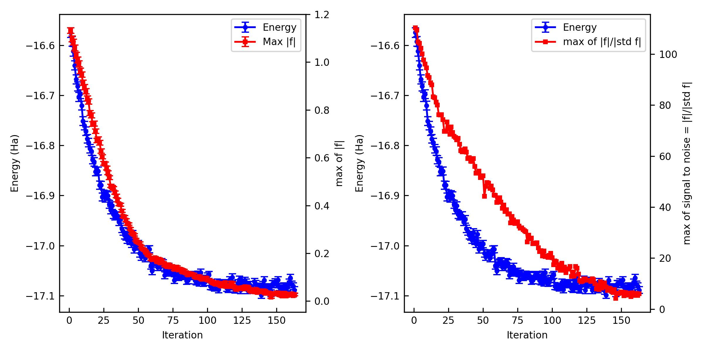
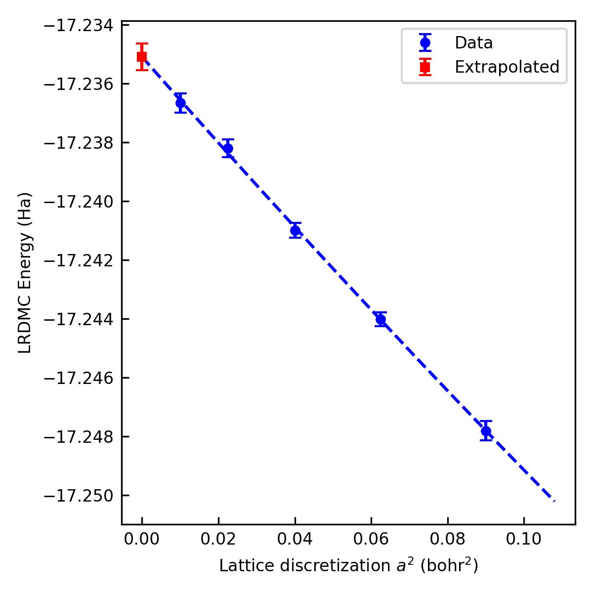

# example01

Total energy of water molecule. One can learn how to obtain the VMC and DMC (in the extrapolated limit) energies of the Water dimer, starting from scratch (i.e., DFT calculation), with cartesian GTOs.

## Generate a trial WF

The first step of ab-initio QMC is to generate a trial WF by a mean-field theory such as DFT/HF. `jQMC` interfaces with other DFT/HF software packages via `TREX-IO`.

One of the easiest ways to produce it is using `pySCF` as a converter to the `TREX-IO` format is implemented. Another way is using `CP2K`, where a converter to the `TREX-IO` format is implemented.

The following is a script to run a HF calculation for the water molecule using `pyscf-forge` and dump it as a `TREX-IO` file.

> [!NOTE]
> This `TREX-IO` converter is being develped in the `pySCF-forge` [repository](https://github.com/pyscf/pyscf-forge) and not yet merged to the main repository of `pySCF`. Please use `pySCF-forge`.

```{literalinclude} 01DFT/01pyscf-forge/run_pyscf.py
:language: python
:caption: run_pyscf.py
```

Launch it on a terminal. You may get `E = -16.9450309201805 Ha` [Hartree-Forck].

```bash
% python run_pyscf.py
```

The following is a script to run a LDA calculation for the water molecule using `cp2k` and dump it as a `TREXIO` file.

```{literalinclude} 01DFT/02cp2k/water.xyz
:language: bash
:caption: water.xyz
```

```{literalinclude} 01DFT/02cp2k/water_ccecp_ccpvtz.inp
:language: bash
:caption: water_ccecp_ccpvtz.inp
```

```{literalinclude} 01DFT/02cp2k/basis.cp2k
:language: bash
:caption: basis.cp2k
```

```{literalinclude} 01DFT/02cp2k/ecp.cp2k
:language: bash
:caption: ecp.cp2k
```

Launch it on a terminal. You may get `E = -17.146760756813901 Ha` [LDA].

```bash
% cp2k.ssmp -i water_ccecp_ccpvtz.inp -o water_ccecp_ccpvtz.out
% mv water_ccecp_ccpvtz-TREXIO.h5 water_ccecp_ccpvtz.h5
```

> [!NOTE]
> One can start from any HF/DFT code that can dump `TREX-IO` file. See the [TREX-IO website](https://github.com/TREX-CoE/trexio) for the detail.

Next step is to convert the `TREXIO` file to the `jqmc` format using `jqmc-tool`

```bash
% jqmc-tool trexio convert-to water_ccecp_ccpvtz.h5 -j2 1.0 -j3 mo
> Hamiltonian data is saved in hamiltonian_data.chk.
```

The generated `hamiltonian_data.chk` is a wavefunction file with the `jqmc` format. `-j2` specifies the initial value of the two-body Jastrow parameter and `-j3` specifies the basis set (`ao`:atomic orbital or `mo`:molecular orbital) for the three-body Jastrow part.

## Optimize a trial WF (VMC)
The next step is to optimize variational parameters included in the generated wavefunction. More in details, here, we optimize the two-body Jastrow parameter and the matrix elements of the three-body Jastrow parameter.

You can generate a template file for a VMCopt calculation using `jqmc-tool`. Please directly edit `vmc.toml` if you want to change a parameter.

```bash
% jqmc-tool vmc generate-input -g
> Input file is generated: vmc.toml
```

```{literalinclude} 03vmc_JSD/vmc.toml
:language: toml
:caption: vmc.toml
```

Please lunch the job.

```bash
% jqmc vmc.toml > out_vmc 2> out_vmc.e # w/o MPI on CPU
% mpirun -np 4 jqmc vmc.toml > out_vmc 2> out_vmc.e # w/ MPI on CPU
% mpiexec -n 4 -map-by ppr:4:node jqmc vmc.toml > out_vmc 2> out_vmc.e # w/ MPI on GPU, depending the queueing system.
```

You can see the outcome using `jqmc-tool`.

```bash
% jqmc-tool vmc analyze-output out_vmc

------------------------------------------------------
Iter     E (Ha)     Max f (Ha)   Max of signal to noise of f
------------------------------------------------------
   1  -16.5743(97)  +1.132(12)   110.335
   2  -16.5921(96)  +1.097(12)   109.386
   3  -16.6117(95)  +1.084(12)   104.849
   4  -16.6399(93)  +1.059(12)   104.245
   5  -16.6678(91)  +1.029(12)   102.269
   6  -16.6819(90)  +1.009(12)   100.122
   7  -16.7028(90)  +0.993(12)    97.718
   8  -16.6974(87)  +0.963(12)    96.040
   9  -16.7200(87)  +0.948(11)    94.616
  10  -16.7511(87)  +0.914(11)    91.563
  11  -16.7602(85)  +0.895(11)    90.790
  12  -16.7714(85)  +0.878(11)    88.758
  13  -16.7867(85)  +0.848(10)    87.979
  14  -16.7940(86)  +0.835(11)    83.253
  15  -16.8065(83)  +0.787(10)    82.875
  16  -16.8112(83)  +0.777(10)    81.196
  17  -16.8284(82)  +0.741(10)    80.058
  18  -16.8327(83)  +0.743(10)    76.214
------------------------------------------------------
```

The important criteria are `Max f` and `Max of signal to noise of f`. `Max f` should be zero within the error bar. A practical criterion for the `signal to noise` is < 4~5 because it means that all the residual forces are zero in the statistical sense.

You can also plot them and make a figure.

```bash
% jqmc-tool vmc analyze-output out_vmc -p -s vmc.jpg
```



If the optimization is not converged. You can restart the optimization.

```toml:vmc.toml
[control]
...
restart = true
restart_chk = "restart.chk" # Restart checkpoint file. If restart is True, this file is used.
...
```

```bash
% jqmc vmc.toml > out_vmc_cont 2> out_vmc_cont.e
```

You can see and plot the outcome using `jqmc-tool`.

```bash
% jqmc-tool vmc analyze-output out_vmc out_vmc_cont
```

## Compute Energy (MCMC)
The next step is MCMC calculation. You can generate a template file for a MCMC calculation using `jqmc-tool`. Please directly edit `mcmc.toml` if you want to change a parameter.

```bash
% jqmc-tool mcmc generate-input -g
> Input file is generated: mcmc.toml
```

```{literalinclude} 04mcmc_JSD/vmc.toml
:language: toml
:caption: mcmc.toml
```

The final step is to run the `jqmc` job w/ or w/o MPI on a CPU or GPU machine (via a job queueing system such as PBS).

```bash
% jqmc mcmc.toml > out_mcmc 2> out_mcmc.e # w/o MPI on CPU
% mpirun -np 4 jqmc mcmc.toml > out_mcmc 2> out_mcmc.e # w/ MPI on CPU
% mpiexec -n 4 -map-by ppr:4:node jqmc mcmc.toml > out_mcmc 2> out_mcmc.e # w/ MPI on GPU, depending the queueing system.
```

You may get `E = -16.97202 +- 0.000288 Ha` and `Var(E) = 1.99127 +- 0.000901 Ha^2` [VMC w/ Jastrow factors]

## Compute Energy (LRDMC)
The final step is LRDMC calculation. You can generate a template file for a LRDMC calculation using `jqmc-tool`. Please directly edit `lrdmc.toml` if you want to change a parameter.

```bash
% cd alat_0.30
% jqmc-tool lrdmc generate-input -g lrdmc.toml
> Input file is generated: lrdmc.toml
```

```{literalinclude} 05lrdmc_JSD/lrdmc.toml
:language: toml
:caption: lrdmc.toml
```

LRDMC energy is biased with the discretized lattice space ($a$) by $O(a^2)$. It means that, to get an unbiased energy, one should compute LRDMC energies with several lattice parameters ($a$) extrapolate them into $a \rightarrow 0$.

The final step is to run the `jqmc` jobs with several $a$, e.g.

```bash
% cd alat_0.30
% jqmc lrdmc.toml > out_lrdmc 2> out_lrdmc.e
```

You may get:

| a (bohr)   | E (Ha)                  |  Var (Ha^2)             |
|------------|-------------------------|-------------------------|
| 0.10       | -17.23667 ± 0.000277    | 1.61602 +- 0.000643     |
| 0.15       | -17.23821 ± 0.000286    | 1.61417 +- 0.000773     |
| 0.20       | -17.24097 ± 0.000325    | 1.69783 +- 0.079714     |
| 0.25       | -17.24402 ± 0.000270    | 1.63235 +- 0.006160     |
| 0.30       | -17.24786 ± 0.000269    | 1.78517 +- 0.066418     |

You can extrapolate them into $a \rightarrow 0$ by `jqmc-tool`

```bash
% jqmc-tool lrdmc extrapolate-energy alat_0.10/lrdmc.rchk alat_0.15/lrdmc.rchk alat_0.20/lrdmc.rchk alat_0.25/lrdmc.rchk alat_0.30/lrdmc.rchk -s lrdmc_ext.jpg
> ------------------------------------------------------------------------
> Read restart checkpoint files from ['alat_0.10/lrdmc.rchk', 'alat_0.15/lrdmc.rchk', 'alat_0.20/lrdmc.rchk', 'alat_0.25/lrdmc.rchk', 'alat_0.30/lrdmc.rchk'].
>   Total number of binned samples = 5
>   For a = 0.1 bohr: E = -17.236661112856858 +- 0.00032635704517869677 Ha.
>   Total number of binned samples = 5
>   For a = 0.15 bohr: E = -17.2382052864809 +- 0.00029723715520135464 Ha.
>   Total number of binned samples = 5
>   For a = 0.2 bohr: E = -17.240993162088692 +- 0.00025740878490131835 Ha.
>   Total number of binned samples = 5
>   For a = 0.25 bohr: E = -17.24401036198691 +- 0.0002365677591168457 Ha.
>   Total number of binned samples = 5
>   For a = 0.3 bohr: E = -17.247804041851044 +- 0.00032247173445041217 Ha.
> ------------------------------------------------------------------------
> Extrapolation of the energy with respect to a^2.
>   Polynomial order = 2.
>   For a -> 0 bohr: E = -17.235093943871842 +- 0.00045277462865289897 Ha.
> ------------------------------------------------------------------------
> Graph is saved in lrdmc_ext.jpg.
> ------------------------------------------------------------------------
> Extrapolation is finished.

```

You may get `E = -17.235094 +- 0.00045 Ha` [LRDMC a -> 0]. This is the final result of this tutorial.


