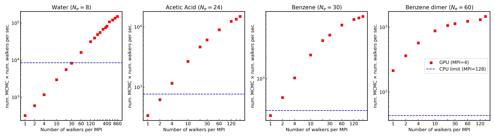
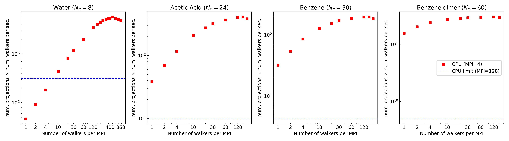
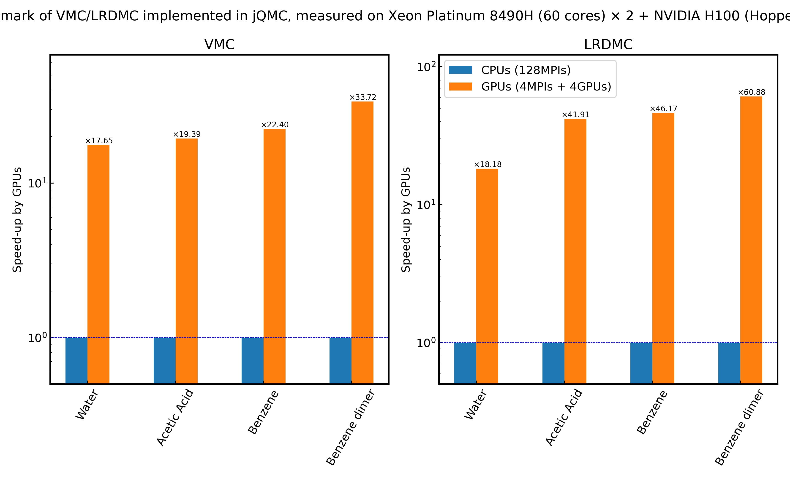

# jQMC Benchmark Results on CPUs and GPUs

This repository contains benchmark results for **jQMC**. The benchmarks compare the performance of Variational Monte Carlo (VMC) and Lattice Regularized Diffusion Monte Carlo (LRDMC) calculations on CPU versus GPU.

The attached graphs are as follows:

- VMC benchmark: CPU vs. GPU.
- LRDMC benchmark: CPU vs. GPU.
- Summary of GPU speedup from both VMC and LRDMC calculations.

---

## Benchmark Setup

The benchmark calculations were performed using four molecular systems:

| Molecule         | Number of electrons | Basis Set           |   ECP          |
|------------------|---------------------|---------------------|----------------|
| Water            | 8                   | `ccecp_ccpvtz`      |  ccECP         |
| Acetic Acid      | 24                  | `ccecp_augccpvtz`   |  ccECP         |
| Benzene          | 30                  | `ccecp_augccpvtz`   |  ccECP         |
| Benzene Dimer    | 60                  | `ccecp_augccpvtz`   |  ccECP         |

**Additional details:**

- **Pseudopotential:** The [ccECP pseudopotential](https://pseudopotentiallibrary.org) was employed for all calculations.
- **Trial Wavefunctions:** Generated using [pySCF](https://pyscf.org) with Gaussian basis functions (Cartesian).
- **Hardware Configuration:** Benchmarks were measured on the supercomputer [Genkai(玄界)](https://www.cc.kyushu-u.ac.jp/scp/eng/system/Genkai/hardware/) at Kyusyu University in Japan, with a dual-socket Xeon Platinum 8490H (60 cores × 2) CPU system and NVIDIA H100 (Hopper) GPUs. For the LRDMC calculations, the CPU runs used 128 MPI processes (i.e. the maximum efficiency), while the GPU runs used 4 MPI processes across 4 GPUs.

---

## Benchmark Results

### VMC Benchmark

The following graph compares the CPU and GPU performance for VMC calculations:

*Observations:*
- The VMC results demonstrate a substantial speedup when utilizing GPUs.
- Speedup factors observed range from approximately **17.65×** (Water) to **33.72×** (Benzene Dimer).

### LRDMC Benchmark

The following graph shows the CPU vs. GPU performance for LRDMC calculations:

*Observations:*
- Similar to VMC, the LRDMC benchmarks highlight significant acceleration when using GPUs.
- Reported speedups for LRDMC range from around **18.18×** (Water) to **60.88×** (Benzene Dimer).

### Summary of GPU Speedup

This summary graph consolidates the overall GPU speedup achieved across both VMC and LRDMC calculations:

---

## Reproducing the Benchmarks

Please have a look at the files included in this directory.
