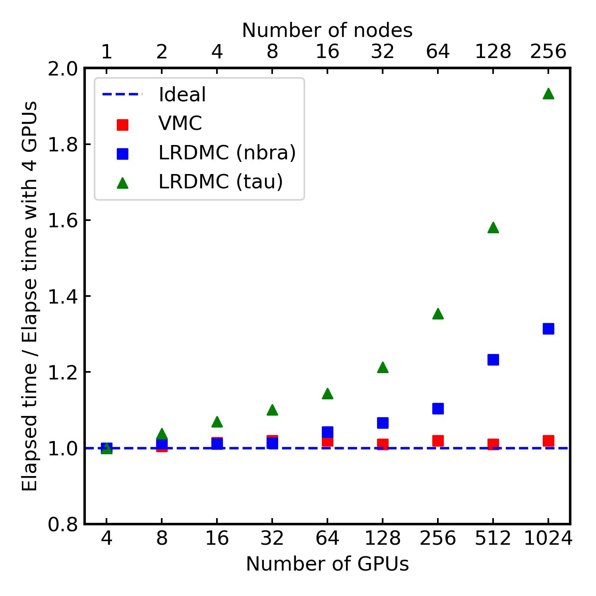

# jQMC weak scaling results on CPUs and GPUs

This directory contains weak-scaling results for **jQMC**. The weak scaling were measured for Variational Monte Carlo (VMC) and Lattice Regularized Diffusion Monte Carlo (LRDMC) calculations on CPUs and GPUs.

The attached graphs are as follows:

- Weak-scaling on CPUs (measured on the supercomputer [Genkai(玄界)](https://www.cc.kyushu-u.ac.jp/scp/eng/system/Genkai/hardware/) at Kyusyu University in Japan.)
- Weak-scaling on GPUs (measured on on the supercomputer [Leonardo](https://www.hpc.cineca.it/systems/hardware/leonardo/) at CINECA in Italy.)

---

## Weak-scaling Setup

The weak-scaling calculations were performed using the water molecule:

| Molecule         | Number of electrons | Basis Set           |   ECP          |
|------------------|---------------------|---------------------|----------------|
| Water            | 8                   | `ccecp_ccpvtz`      |  ccECP         |

**Additional details:**

- **Pseudopotential:** The [ccECP pseudopotential](https://pseudopotentiallibrary.org) was employed for all calculations.
- **Trial Wavefunctions:** Generated using [pySCF](https://pyscf.org) with Gaussian basis functions (Cartesian).
- **Hardware Configuration (CPUs):** CPU Benchmarks were measured on the supercomputer [Genkai(玄界)](https://www.cc.kyushu-u.ac.jp/scp/eng/system/Genkai/hardware/) at Kyusyu University in Japan. One node is equipped with a dual-socket Xeon Platinum 8490H (60 cores × 2) CPU system. The CPU runs used 128 MPI processes (i.e. the maximum efficiency).
- **Hardware Configuration (GPUs):** GPU Benchmarks were measured on the supercomputer [Leonardo](https://www.hpc.cineca.it/systems/hardware/leonardo/) at CINECA in Italy. One node is equipped with single socket 32 cores Intel Ice Lake CPU (Intel Xeon Platinum 8358, 2.60GHz) and 4 NVIDIA custom Ampere A100 GPUs (64GB HBM2e). The GPU runs used 4 MPI processes per node (i.e., 1 MPI is bound to one GPU).

---

## Weak-scaling Results on CPUs

> [!NOTE]
> The degradation of weak scaling in the LRDMC calculations as the number of MPI processes increases is not solely due to MPI communication. On CPUs, we have observed that when allocating many JAX processes across a large number of CPU cores, some processes randomly become extremely slow. Since this issue does not occur when running JAX processes on GPUs, we believe it is likely unexpected behavior of the XLA compiler on CPUs. See also our [JAX GitHub discussion](https://github.com/jax-ml/jax/discussions/27949) for more details.

The plot above shows the weak‑scaling behavior of `jQMC` on the CPU cluster, measured from 120 up to 3840 MPI processes (120 MPI processes per node, 1–32 nodes).  Each curve is the elapsed time normalized to the 120 MPI processes baseline:

- **Ideal** (dashed blue): perfectly flat at 1.00
- **VMC** (red): Variational Monte Carlo
- **LRDMC (tau)** (green): LRDMC with a fixed *projection time* per branching cycle. $\tau$ is set 0.1 a.u., resulting in 27 projections in average.
- **LRDMC (nbra)** (blue): LRDMC with a fixed *number* of branching steps. 27 projections between branchings for all walkers.

### Key observations

1. **VMC (red)**
   - Stays within ±2% of the 480‑rank run even at 3 840 ranks.
   - Very low synchronization cost ⇒ near‑ideal weak scaling on CPUs.

2. **LRDMC, fixed branching count (nbra, blue)**
   - Gradual overhead growth:
     - ~2% at 960 MPIs
     - ~45% at 3840 MPIs
   - Fixing the *number* of branches maintains a balanced workload per rank, yielding reasonably good scalability.

3. **LRDMC, fixed branching time (tau, green)**
   - Overhead increases sharply with rank count:
     - ~20% at 240 MPIs
     - ~40% at 480 MPIs
     - ~75% at 960 MPIs
     - ~150% at 1920 MPIs
     - ~300% at 3840 MPIs
   - Fixing the *time* per cycle causes load imbalance and bursty communication, severely degrading CPU scaling.

### Recommendations

- For large‑scale CPU LRDMC runs, prefer the **nbra** algorithm to minimize overhead.
- When extreme scalability is required without branching, pure **VMC** remains the most efficient choice on CPU clusters.

## Weak-scaling Results on GPUs

The plot above shows the weak‑scaling behavior of `jQMC` code measured on up to 1024 GPUs.  Each curve plots the elapsed time normalized to the 4GPUs run:

- **Ideal** (dashed blue): perfectly flat at 1.00
- **VMC** (red): Variational Monte Carlo
- **LRDMC (tau)** (green): LRDMC with a fixed *projection time* per branching cycle. $\tau$ is set 0.1 a.u., resulting in 27 projections in average.
- **LRDMC (nbra)** (blue): LRDMC with a fixed *number* of branching steps. 27 projections between branchings for all walkers.

### Key observations

1. **VMC (red)**
   - Remains within ±1% of the 4‑GPUs baseline all the way to 1024 GPUs.
   - Very little inter‑GPU communication in pure VMC ⇒ near-ideal weak scaling.

2. **LRDMC, fixed branching count (nbra, blue)**
   - Overhead grows slowly:
     - ~2% at 64 GPUs
     - ~8% at 256 GPUs
     - ~32% at 1024 GPUs
   - Fixing the *number* of branches yields more uniform work per rank and smoother scaling.

3. **LRDMC, fixed branching time (tau, green)**
   - Overhead rises quickly as GPUs increase:
     - ~7% at 16 GPUs
     - ~36% at 256 GPUs
     - ~94% at 1024 GPUs
   - Fixing the *time* per cycle introduces load imbalance and bursty communication, degrading scalability.

### Recommendations

- For large-scale LRDMC production runs, prefer the **nbra** algorithm to maintain efficiency.
- Pure VMC remains the most scalable option when you need maximum GPU throughput with minimal synchronization.

---

## Reproducing the Benchmarks

Please have a look at the files included in this directory.
