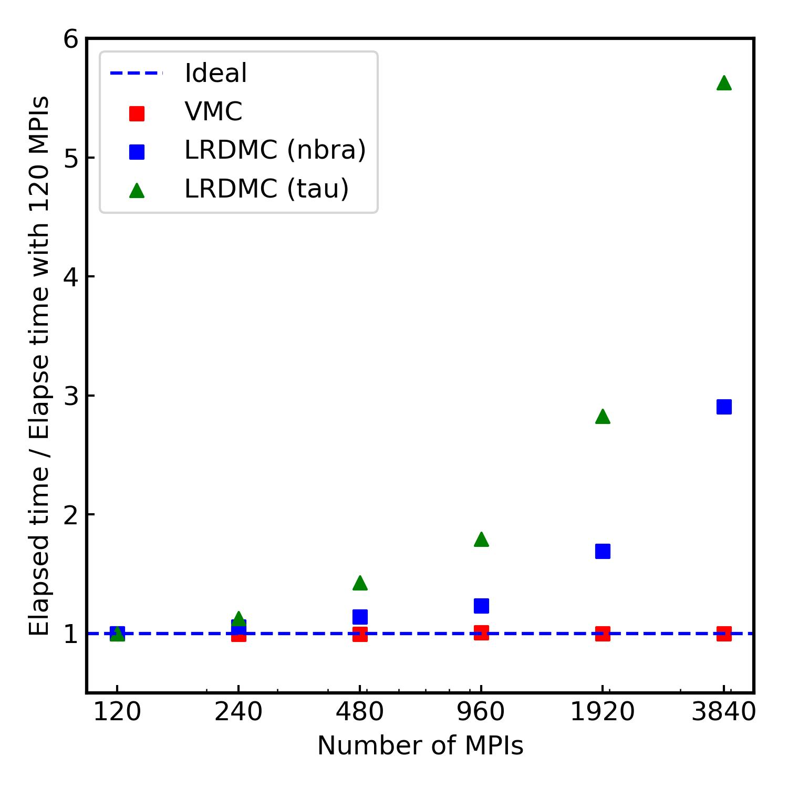

# jQMC weak scaling results on CPUs and GPUs

This directory contains weak-scaling results for **jQMC**. The weak scaling were measured for Variational Monte Carlo (VMC) and Lattice Regularized Diffusion Monte Carlo (LRDMC) calculations on CPUs and GPUs.

The attached graphs are as follows:

- Weak-scaling on CPUs
- Weak-scaling on GPUs

---

## Weak-scaling Setup

The weak-scaling calculations were performed using the water molecule:

| Molecule         | Number of electrons | Basis Set           |   ECP          |
|------------------|---------------------|---------------------|----------------|
| Water            | 8                   | `ccecp_ccpvtz`      |  ccECP         |

**Additional details:**

- **Pseudopotential:** The [ccECP pseudopotential](https://pseudopotentiallibrary.org) was employed for all calculations.
- **Trial Wavefunctions:** Generated using [pySCF](https://pyscf.org) with Gaussian basis functions (Cartesian).
- **Hardware Configuration:** Benchmarks were measured on the supercomputer [Genkai(玄界)](https://www.cc.kyushu-u.ac.jp/scp/eng/system/Genkai/hardware/) at Kyusyu University in Japan. One node is equipped with a dual-socket Xeon Platinum 8490H (60 cores × 2) CPU system and with or without NVIDIA H100 (Hopper) GPUs. For the LRDMC calculations, the CPU runs used 128 MPI processes (i.e. the maximum efficiency), while the GPU runs used 4 MPI processes across 4 GPUs.

---

## Weak-scaling Results

### on CPUs

WIP

### on GPUs

WIP

---

## Reproducing the Benchmarks

Please have a look at the files included in this directory.
