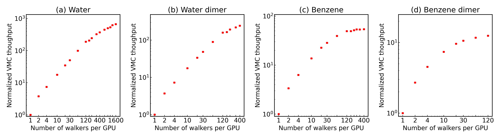
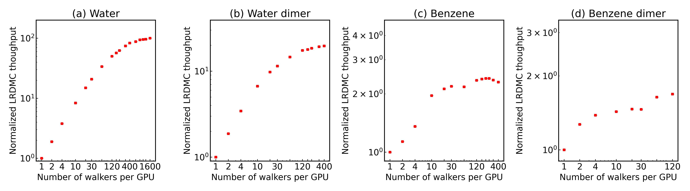

# jqmc-workflow-example02: GPU Vectorization Benchmark (Walker Scaling)

Vectorization benchmark of **jQMC** on GPUs. The throughput of MCMC and LRDMC calculations is measured as a function of the number of walkers assigned to a single GPU, sweeping from 8 to 8192 walkers.

## Overview

This example automates the full QMC benchmark pipeline for a water molecule using `jqmc_workflow`:

```
pySCF (DFT-LDA) --> WF conversion (JSD) --> VMC optimization --> MCMC $\times$ 11 walker counts
                                                           --> LRDMC $\times$ 11 walker counts
```

The workflow DAG is constructed programmatically in `run_pipelines.py` and executed via `Launcher`. The WF conversion and VMC optimization are run once; then MCMC and LRDMC production runs are launched for each walker count independently.

### Target system

| Molecule | Electrons | Basis set       | ECP   |
|----------|-----------|-----------------|-------|
| Water    | 8         | cc-pVTZ (ccECP) | ccECP |

### Ansatz and optimization

- **JSD** (Jastrow-Slater Determinant): J2 (two-body, exponential) + J3 (three-body, AO-small basis). No J1.
- **VMC optimization**: 50 steps with SR optimizer (`adaptive_learning_rate = True`, `delta = 0.35`)
- Determinant part is **not** optimized (`opt_with_projected_MOs = False`)

### Walker counts

```
walkers = 8  16  32  64  128  256  512  1024  2048  4096  8192
```

### Measurement parameters

For each walker count, MCMC and LRDMC use **explicit step counts** (not target-error convergence):

| Method | Steps | nmpm | alat |
|--------|-------|------|------|
| MCMC   | 1000  | --    | --    |
| LRDMC  | 1000  | 40   | 0.30 |

## Prerequisites

- `jqmc`, `jqmc-tool`, and `jqmc_workflow` installed
- `pyscf` with TREXIO support (`pyscf.tools.trexio`)
- Machine configuration in `jqmc_setting_local/`

## Quick start

```bash
cd examples/jqmc-workflow-example02
python run_pipelines.py
```

The script performs the following steps automatically:

### Step 1 -- DFT trial wavefunction (pySCF)

A DFT-LDA calculation is run locally with `pySCF` to produce a TREXIO file for a water molecule (ccECP / cc-pVTZ, Cartesian). If the TREXIO file already exists, this step is skipped.

```python
# Generated automatically (embedded in run_pipelines.py)
from pyscf import gto, scf
from pyscf.tools import trexio

mol = gto.Mole()
mol.atom = """
O 5.000000 7.147077 7.650971
H 4.068066 6.942975 7.563761
H 5.380237 6.896963 6.807984
"""
mol.basis = "ccecp-ccpvtz"
mol.unit = "A"
mol.ecp = "ccecp"
mol.cart = True
mol.build()

mf = scf.KS(mol).density_fit()
mf.xc = "LDA_X,LDA_C_PZ"
mf.kernel()

trexio.to_trexio(mf, "water_trexio.hdf5")
```

### Step 2 -- WF conversion (JSD)

The TREXIO file is converted to `hamiltonian_data.h5` with a JSD Jastrow factor:

```python
WF_Workflow(
    trexio_file="water_trexio.hdf5",
    j1_parameter=None,     # no one-body Jastrow
    j2_parameter=1.0,      # two-body Jastrow (exponential)
    j3_basis_type="ao-small",  # three-body Jastrow in AO-small basis
)
```

### Step 3 -- VMC optimization

J2 and J3 parameters are optimized (J1 = None, MOs not optimized):

```python
VMC_Workflow(
    server_machine_name="cluster",
    queue_label="cores-4-mpi-4-gpu-4-omp-1-3h",
    number_of_walkers=256,
    num_opt_steps=50,
    opt_J1_param=False,
    opt_J2_param=True,
    opt_J3_param=True,
    opt_with_projected_MOs=False,
    target_error=1.0e-3,
    optimizer_kwargs={
        "method": "sr",
        "delta": 0.350,
        "epsilon": 0.001,
        "adaptive_learning_rate": True,
    },
)
```

### Step 4 -- MCMC and LRDMC production (per walker count)

For **each** of the 11 walker counts, MCMC and LRDMC production runs are launched independently. All 22 jobs (11 $\times$ 2) are submitted in parallel via `Launcher`:

```python
# For each walker count nw in [8, 16, ..., 8192]:
MCMC_Workflow(
    server_machine_name="cluster",
    queue_label="cores-4-mpi-4-gpu-4-omp-1-30m",
    number_of_walkers=nw,
    pilot_steps=1000,  # explicit step count
)

LRDMC_Workflow(
    server_machine_name="cluster",
    queue_label="cores-4-mpi-4-gpu-4-omp-1-30m",
    alat=0.30,
    number_of_walkers=nw,
    num_mcmc_per_measurement=40,
    pilot_steps=1000,  # explicit step count
)
```

## Directory structure

After running the pipeline:

```
jqmc-workflow-example02/
├── run_pipelines.py         # Main script
├── run_pyscf.py             # Standalone pySCF script (reference)
├── water_trexio.hdf5        # TREXIO file (pySCF output)
├── jqmc_setting_local/      # Machine configuration
├── 01_wf/                   # WF_Workflow: TREXIO --> hamiltonian_data.h5
├── 02_vmc/                  # VMC_Workflow: Jastrow optimization
├── 03_mcmc/                 # MCMC production (per walker count)
│   ├── w00008/
│   ├── w00016/
│   ├── ...
│   └── w08192/
├── 04_lrdmc/                # LRDMC production (per walker count)
│   ├── w00008/
│   ├── w00016/
│   ├── ...
│   └── w08192/
└── plot_summary.ipynb       # Jupyter notebook for plotting results
```

## Workflow DAG

```
pySCF --> WF --> VMC ─┬─--> MCMC  (w8)    ─┐
                   ├─--> MCMC  (w16)    │
                   ├─--> ...            ├─--> Summary table
                   ├─--> MCMC  (w8192)  │
                   ├─--> LRDMC (w8)     │
                   ├─--> LRDMC (w16)    │
                   ├─--> ...            │
                   └─--> LRDMC (w8192)  ─┘
```

## Machine configuration

This example assumes a cluster where each node has 4 NVIDIA GPUs. The benchmark uses a single node with 4 MPI processes (one per GPU).

To run on a different cluster, change `SERVER`, `QUEUE_LABEL_s`, and `QUEUE_LABEL_l` in `run_pipelines.py` and provide the appropriate machine configuration in `jqmc_setting_local/`.

## Benchmark results

### MCMC throughput



### LRDMC throughput



## Output

The script prints a summary table after all calculations complete:

```
| Walkers  |  E_MCMC (Ha)      | MCMC t_net (s) |  E_LRDMC (Ha)     | LRDMC t_net (s) |
|----------|-------------------|----------------|-------------------|-----------------|
|        8 |    -X.XXXXX(XX)   |          XX.X  |    -X.XXXXX(XX)   |           XX.X  |
|       16 |    -X.XXXXX(XX)   |          XX.X  |    -X.XXXXX(XX)   |           XX.X  |
|      ...                                                                              |
|     8192 |    -X.XXXXX(XX)   |          XX.X  |    -X.XXXXX(XX)   |           XX.X  |
```

The net computation time (excluding JIT compilation) is parsed from the jQMC output files.
